# Power BI & PowerQuery | Azure DevOps – Obtener Response de una API mediante los ID de la API

## Intro

En este repositorio de conocimiento veremos como obtener la respuesta de una API, de la cual obtendremos los respectivos ID asociados a un proyecto en Azure DevOps.

## Primero

Para poder empezar, necesitaremos agregar los orígenes de los datos, para ello realizar lo descrito a continuación:

1. Hacer clic en la parte superior donde sale “Get Data” y buscar la opción “Web”.

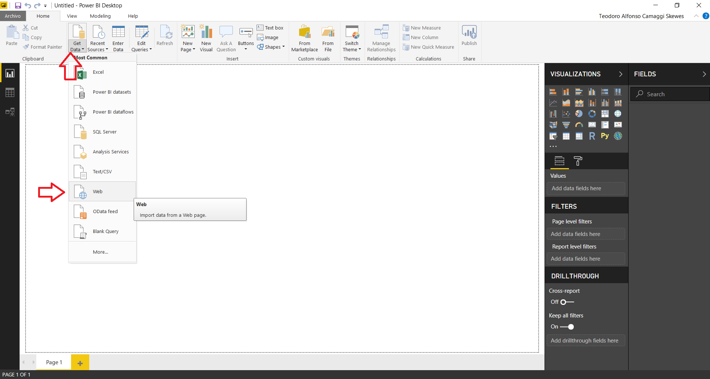

2. Luego, en la opción “Basic” pegaremos donde sale URL lo siguiente <em>https://{ORGANIZATION_NAME}.visualstudio.com/{TEAM_PROJECT_NAME}/_apis/test/runs?includeRunDetails=true&api-version=5.0</em>
   luego daremos en “OK”. Posiblemente nos pida ingresar credenciales, las cuales se ingresan en el momento que se piden como autentificación básica.
3. Al agregar esa fuente, se abrirá la pestaña de “Power Query Editor” mostrando lo siguiente:

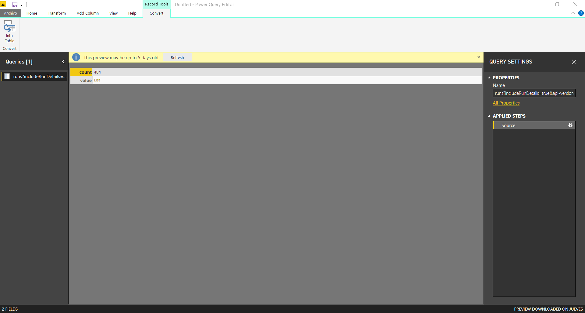

4. Hacer clic en el valor de la columna que dice “List” en amarillo, esto hará que se expanda el resultado.
5. Una vez hecho el paso anterior, debería quedar de la siguiente forma:

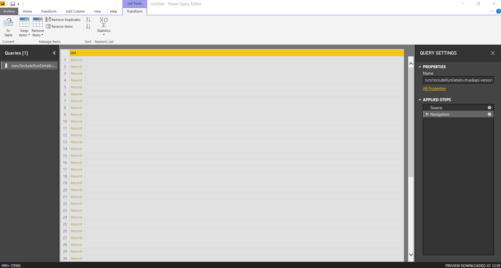

Cuando se vea así, hacer clic derecho en la columna “List” y darle a la opción “To Table”. Nos dará la opción de seleccionar delimitadores y como manejar columnas extras, dejar valores por defecto y dar en “OK”. Nos damos la opción de seleccionar delimitadores y como manejar columnas extras, dejar los valores por defecto y dar en “OK”.

6. Luego de lo anterior, nos quedará algo así:

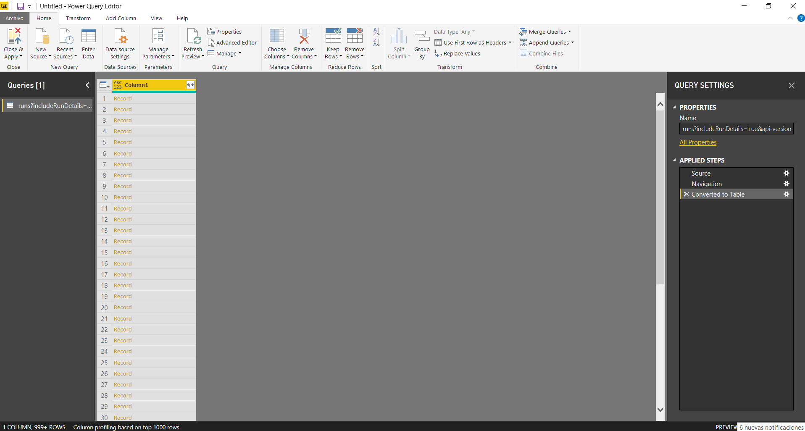

7. Siguiendo, hacer clic en las flechas que se muestran al lado de column 1 por el lado derecho, seleccione el valor “id” solamente y “OK”.

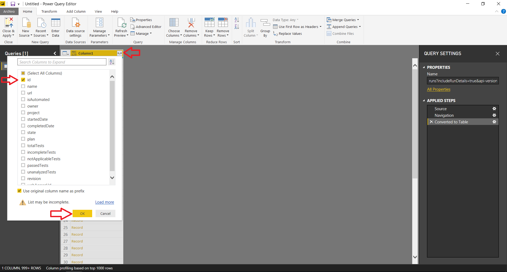

8. Renombraremos la columna a Id y la tabla a “getId”.
9. Para finalizar este paso, haremos clic derecho y le daremos en la opción de “Add as New Query”.

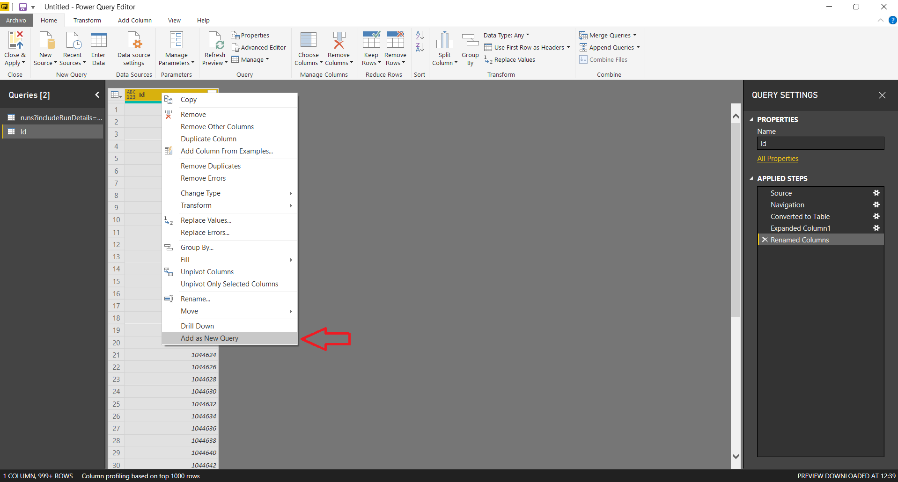

10. Nos quedará la siguiente lista con los Id obtenidos de esa API:

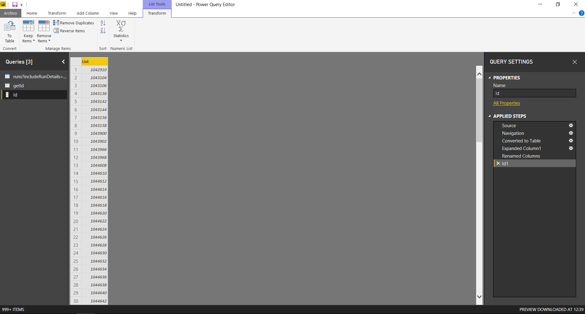

## Segundo

Al tener los Id en una lista, nos permitirá usarlos como parámetros para luego pegarle a la API.

Para pasarlos a parámetros, hay que hacer lo siguiente:

1. Hacer clic en “Manage Parameters” en la pestaña “Home” del “Power Query Editor”, luego en “New parameter”.

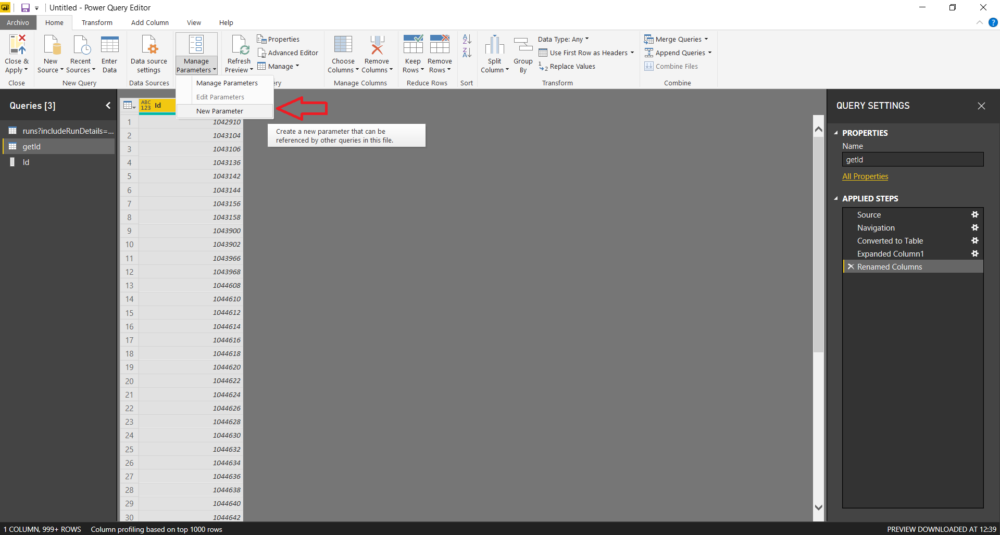

2. Rellenar con los datos como se muestra en la siguiente imagen:

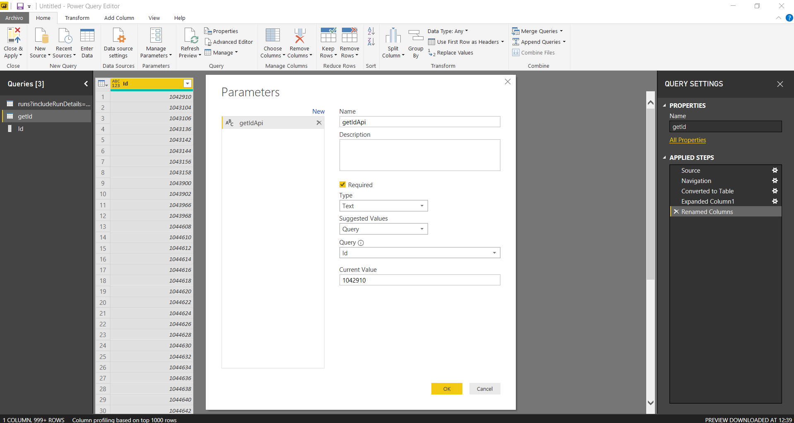

Donde la query seleccionada es la que habíamos creado anteriormente con las listas, dejándola como texto y el valor inicial el primer valor que trae.

## Tercero

Para poder pegar a la API con los ID que nos trajimos, hay que agregar un nuevo origen de datos, seleccionamos JSON. Podremos cargar cualquier JSON, después se cambiarán las propiedades para cargar lo que necesita en realidad.

1. Al cargar el JSON, tendremos que hacer clic en el engranaje que aparece en la parte derecha de la pantalla:

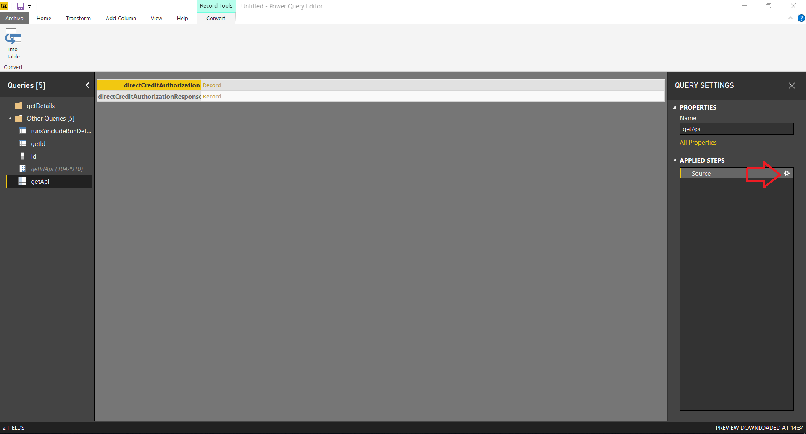

2. Hacemos clic en “Advanced” y rellenamos como se muestra en la imagen:

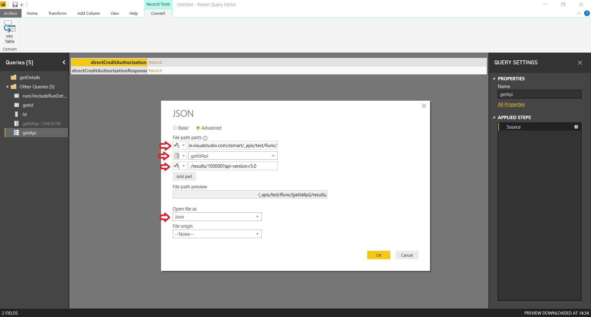

Se agrega la primera parte de la URL como texto, luego el ID como parámetro, el cual fue creado anteriormente y luego la última parte de la URL como texto.

3. Nos saldrá un error, pero para corregirlo, hay que hacer clic derecho en la tabla que se nos creó para este caso, en mi caso le puse “getApi”. Y nos dirigimos al “Advanced Editor”. Donde sale “File.Contents” cambiar por “Web.contents” y darle “OK”.
4. Después de lo anterior, nos saldrá un error como este: “Formula.Firewall: Query ‘getApi’ (step ‘Source’) references other queries or steps, so it may not directly access a data source. Please rebuild this data combination.” Para corregirlo ir a Archivo, “Options & Settings”, “Options”, bajamos y seleccionamos Privacy. Y por último, seleccionamos la opción “Ignore the Privacy…”.
5. Refrescamos la vista moviéndonos de pestaña o guardando. Y no debería quedar algo así:

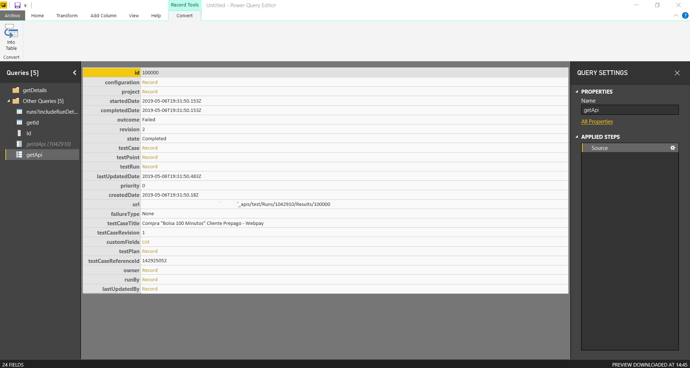

6. Como se hizo en los pasos anteriores, convertimos en tabla.
7. Ahora, hay que ir a la pestaña “Transform” y hacer clic en “Transpose”.

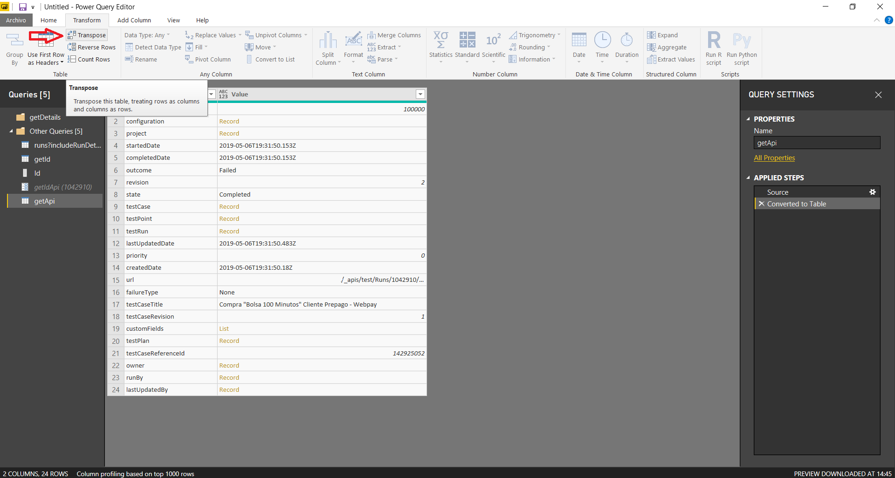

8. Luego en la misma pestaña de “Transform”, seleccionamos la opción de “Use first row as headers”.

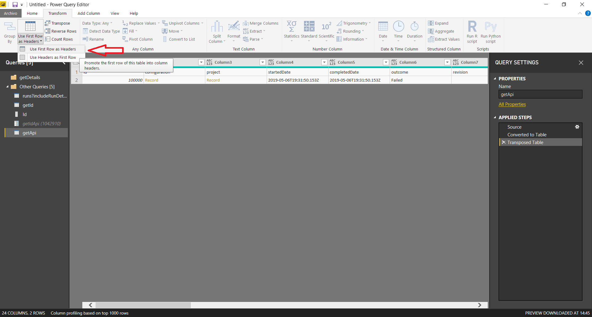

9. Como se hizo en los pasos anteriores, vamos a expandir todas las columnas que nos dejen expandir, quedando al final algo así:

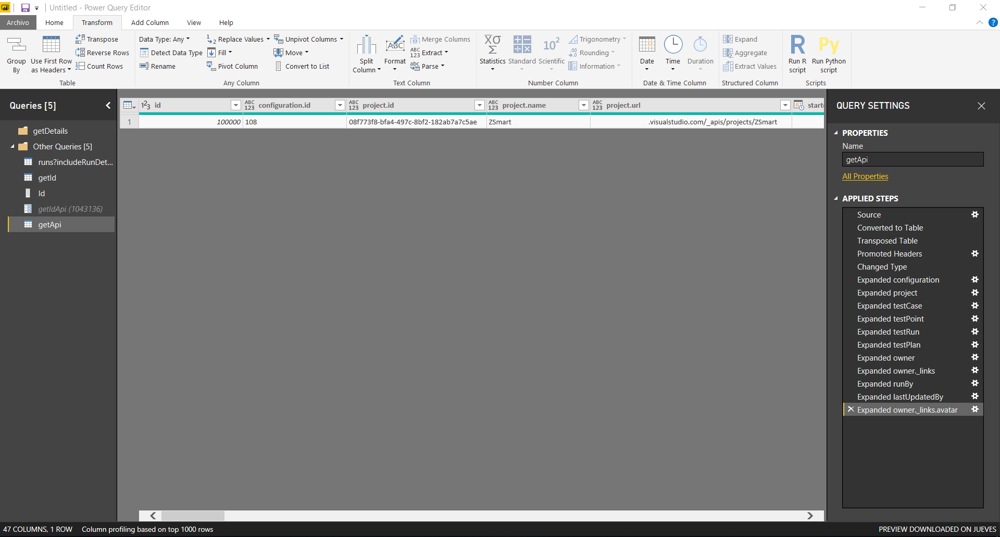

10. Después crearemos una función, haciendo clic derecho en la misma tabla que estabamos trabajando recién, le damos un nombre y “OK” (En mi caso, la llamé getDitails).

## Cuarto

Para seguir en esta travesía, volvemos a la tabla que llamamos “getId”.

1. Nos dirigimos a la pestaña “Add column” y seleccionamos la opción “Invoke Custom Function”
2. Rellenamos con la función que creamos anteriormente y con el valor de ID que queramos.

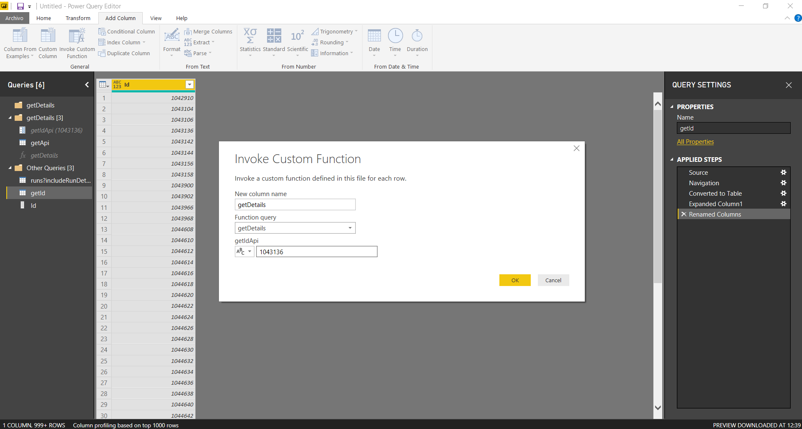

3. Hacemos clic derecho sobre la columna nueva “getDetails” y le hacemos clic en “Remove errors” para evitar columnas que no son aceptadas.
4. Por último, como anteriormente hicimos, expandimos todas las columnas que se puedan. Quedando algo así:

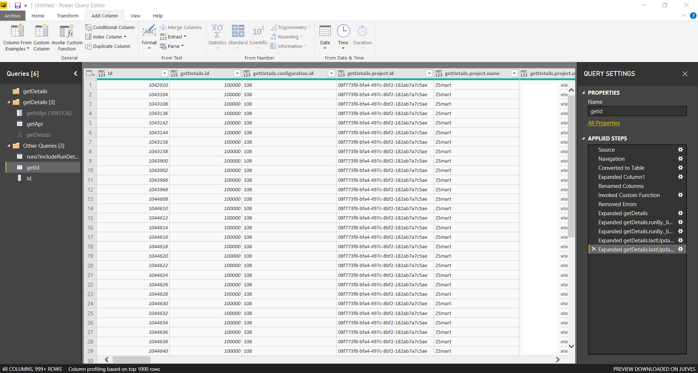

5. Hacemos clic en “Close & Apply” para guardar los cambios en “Power Query Editor”.

## Quinto

Para finalizar esto, debemos establecer la relación entre la lista ID y el ID de la tabla que está compuesta por “ID + RESPONSE”.

1. Hacemos clic en la pestaña “Manage Relationships”, y le damos un “New” (En el caso de que existan algunas por defecto, eliminarlas).
2. Lo dejamos como se muestra en la siguiente imagen:

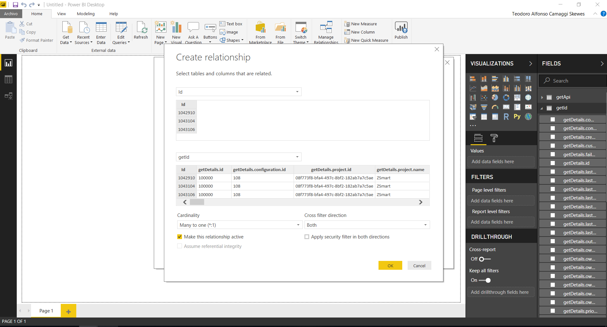

Luego de esto le damos OK.

## Resultado

Después de haber seguido todos estos pasos, podrá actualizar los ID que se necesiten y junto con ello, las respuestas de la API.

Aquí un ejemplo:

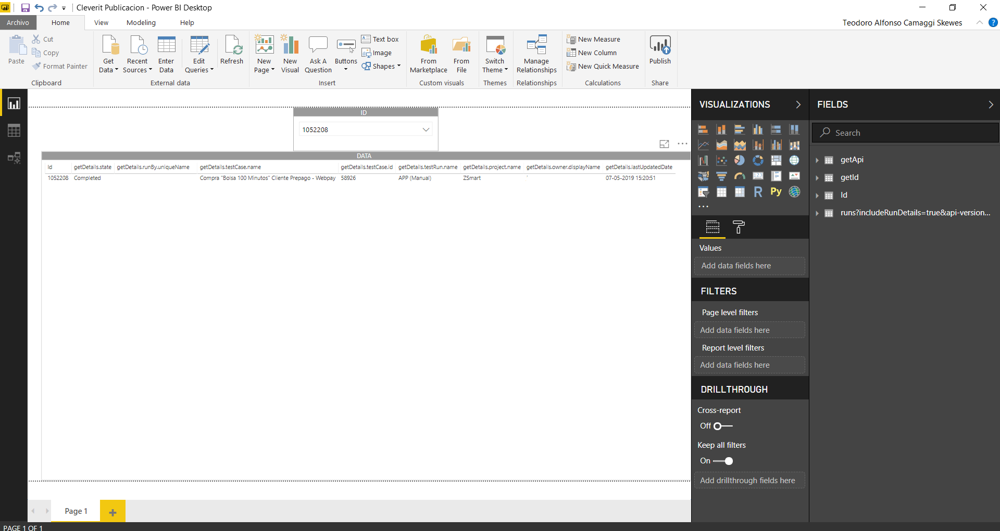
