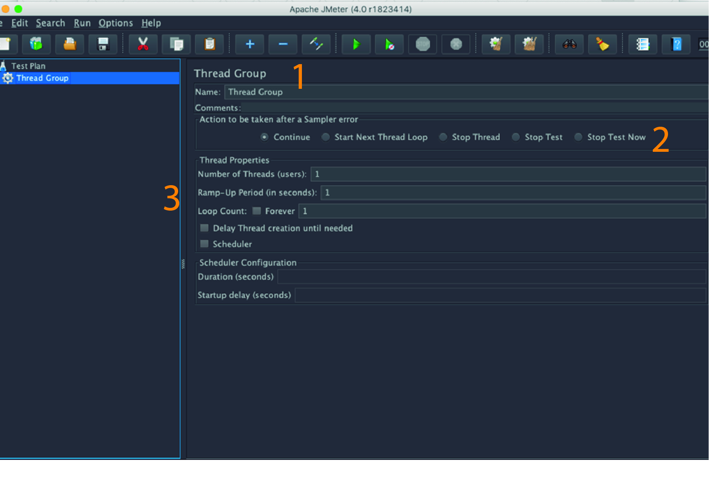
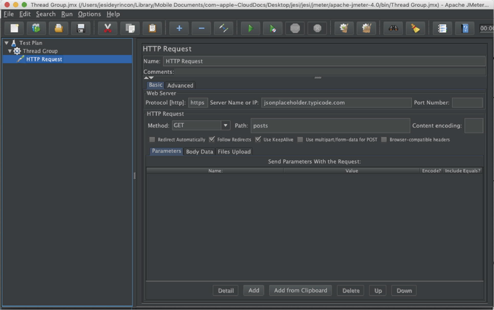
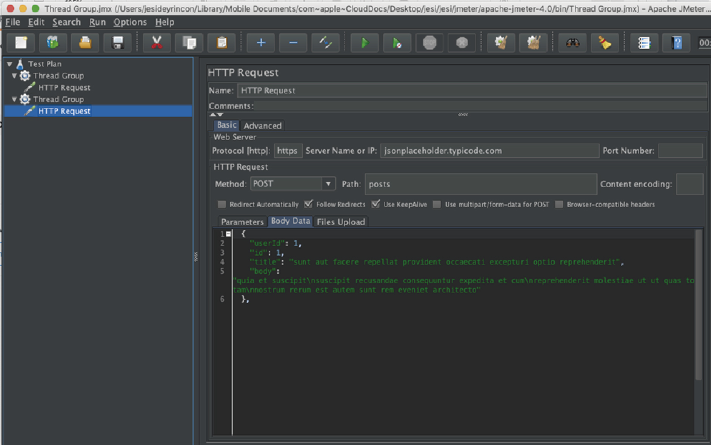
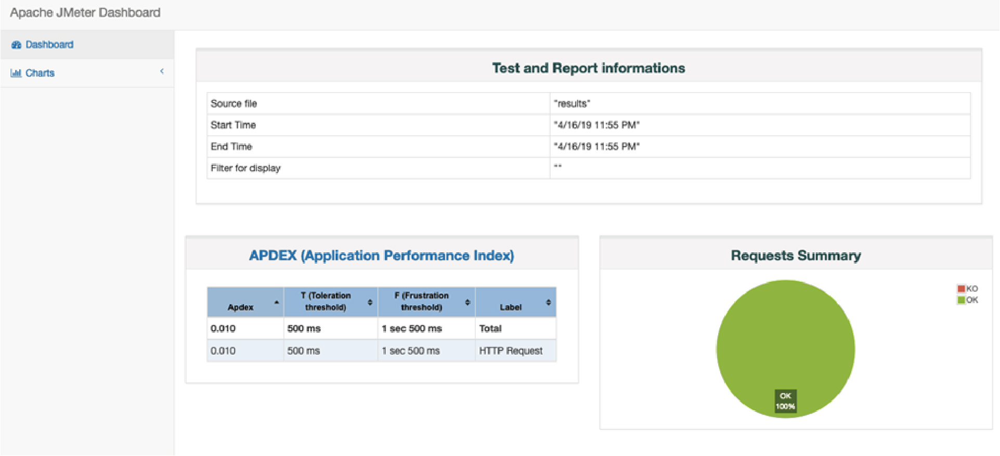
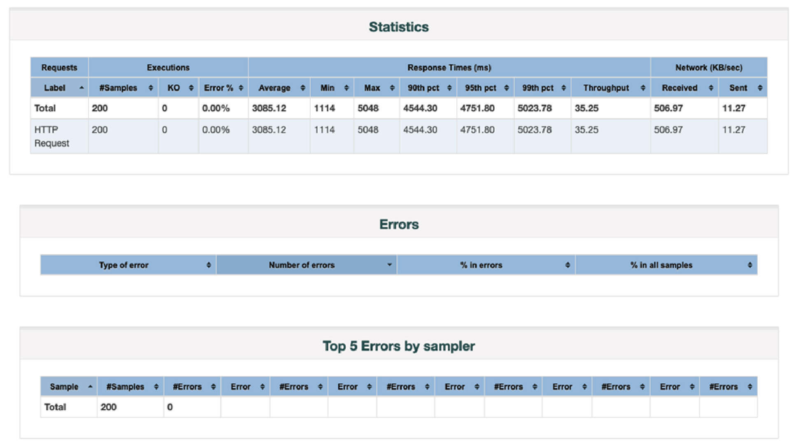

# Pruebas de Stress a Microservicios usando jmeter

Muchas veces, en algunos proyectos se dejan las pruebas para el final cuando ya se tiene el Proyecto o Sistema integrado, aumentando un riesgo a la hora de resolver incidencias que se pudieron resolver antes. En un entorno ágil, las pruebas deben estar desde el día 0 junto a los métodos, luego con los componentes y finalmente con la integración.

El QA ha dejado de hacer las cosas manuales y ha sido una pieza que aparece solo en la final del juego y se está involucrando en cada proceso donde se requiere la calidad, tanto en el código, arquitectura y experiencia de usuario.

Una buena manera de detectar problemas de arquitectura son las pruebas de estrés! ¿Y por qué esperar en el front esté listo, cuando tenemos el backend?

En este artículo les contamos un poco sobre, ¿cómo configurar jmeter en su ambiente?, ¿cómo correr las pruebas y dar algunos consejos?.

Jmeter lo puede descargar en su página oficial: https://jmeter.apache.org/download_jmeter.cgi

¡Uno de sus requisitos es tener el Java JDK instalado! Una vez tengan la carpeta en su local, pueden abrir el GUI desde la carpeta bin , el ejecutable se llama ApacheJMeter.jar

Recomendación : El GUI usenlo únicamente para crear de los casos de prueba, Las pruebas se deben correr a través de la consola mediante un script que les mostraremos más adelante..

Jmeter se compone de plan de pruebas y casos de prueba que se agrupan por grupo de hilos. Dentro de cada grupo de hilos (Thread Group) procederán a hacer lo que se le indiquen los elementos que se asociarán a cada grupo, estos elementos pueden ser desde peticiones http hasta peticiones JDBC. En este capítulo indicaré la realización de peticiones de tipo HTTP.

Para poder probar un microservicio, es necesario tener en cuenta el endpoint , el body en caso de necesitar y un header si es necesario. A continuación realizaremos 2 casos de prueba de MS, usando POST y un GET.

Por primera vez indicaremos el significado de cada uno de los campos dentro de la pantalla en la creación de un grupo de Hilos. Para crear un Grupo de hilos es necesario abrir el Apache JMeter y dar clic derecho sobre el TestPlan y agregar el Grupo de Hilos.

1. Indica el nombre del Grupo de Hilos . Puede ser un nombre simbólico que tenga significado para la acción que realizarán ese grupo de hilos
1. Son las acciones que se esperan que se realicen.
1. Son las propiedades que tendrán los Hilos:
   - El número de hilos. (que viene siendo como un número de usuarios)
   - Rango de tiempo en el que todos los hilos van a estar generando peticiones. Es decir, si desea que los hilos se conecten concurrentemente hasta alcanzar 1 hora, deberá colocar en este campo 3600
   - El contador de los ciclos que se desea para que se conecte los hilos, que también se pueda utilizar la opción del ciclo infinito, entonces se lanzarán los hilos infinitamente hasta que detenga el test
   - Las opciones de Scheduler Configuration datos vienen de la organización del tiempo en el que se desea la experiencia de la ejecución de los hilos.

Ahora sí, primero realizaremos una petición de tipo GET nuestro proyecto de API, para esto usaré una API de ejemplo de la página “jsonplaceholder”

El **endpoint** que usará será el siguiente: https: //jsonplaceholder.typi code.com/posts

Y nuestra creación de la prueba en JMeter queda de la siguiente manera:

**Nota importante:** El GUI de JMeter es más conveniente usar para crear los casos de pruebas para poder correr los tests es más recomendable usar el script y verificar todo a nivel de consola. El script se debe ejecutar desde la carpeta bin.

El script que se debe ejecutar es el siguiente: jmeter -n -t [ruta para probar el archivo JMX] -l [ruta al archivo de resultados] “

Archivo JMX es el nombre del test que ha sido creado en el GUI. Los tests creados por JMeter llevan la extensión jmx (Java Management Extension)

Realice el mismo ejercicio ahora lanzando un POST, enviando un JSON como body, quedando de la siguiente manera:

Para poder generar gráficos o informes en un html es necesario ejecutar el siguiente comando dentro de la carpeta bin de jmeter

jmeter -n -t _archivo de prueba JMX_ -l _archivo de registro de prueba_ -e -o _Ruta a la carpeta de salida_

Al final los gráficos quedan de la siguiente manera:

Para la realización de las pruebas de estrés lo que hay que tener en la cuenta es saber cuál es el máximo de usuarios concurrentes que el API puede aceptar la solicitud e ir por más, por saber en qué punto podríamos lanzar una alerta por sobrecarga de hilos.

Para una ejecución de las pruebas que creamos con jmeter se usan otras herramientas que nosotras una mejor interpretación de las estadísticas, una de ellas es Azure Devops, tiene una sección en donde se pueden cargar pruebas de formato más descriptivos!

En la próxima ocasión estaremos contando sobre el envío de Headers dentro de un request y creación de variables aleatorias.
