# Queries en Azure DevOps

## ¿Cómo crear una Work Item Querie?

Con Azure DevOps tenemos un sinfín de posibilidades que nos permitirán medir nuestro avance tanto individual, como por equipo. Ejemplo de ellos tenemos las QUERIES. Ocuparla dentro del la herramienta nos va a permitir filtrar la información justa y necesaria que queramos visualizar.
**Para crearlas, es muy simple:**

1. Ingresar al Proyecto en cuestión y en el Menú izquierdo seleccionar la opción "BOARDS"
   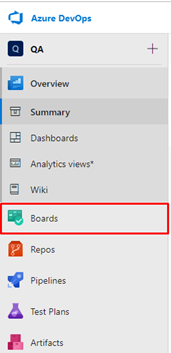

2. Una vez allí seleccionar Queries:
   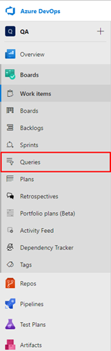
3. Inmediatamente se abrirá la ventana para la creación de nueva Query:
   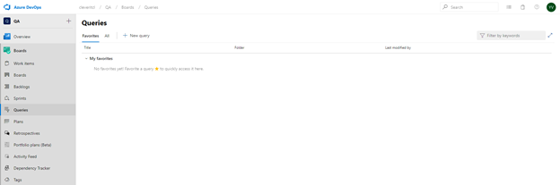
4. Hacer click sobre la opción "New Query"
   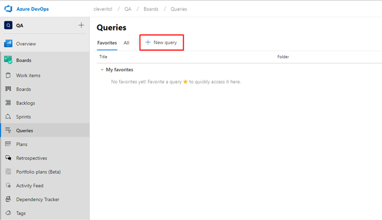
5. Una vez presionada la opción se abrirá la siguiente ventana para que puedas Editar la Query:
   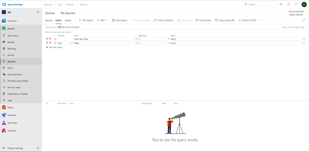

## Búsqueda de WorkItem:

Podemos buscar un Tipo de Work Item (o varios) dependiendo del operador que utilicemos y que estén en el estado que deseemos (o varios estados), de esta forma si queremos buscar todos los Bugs, que se encuentren en estado “Closed” colocaríamos la información de la siguiente manera:
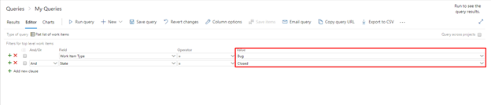

1. Posteriormente hacemos click en "Run Query" y tendremos el resultado de nuestra consulta:
   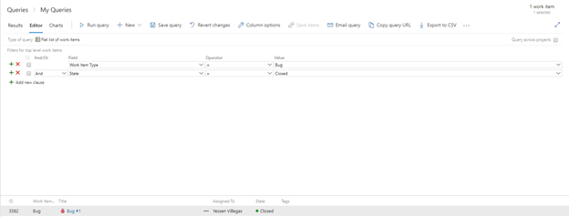

2. Por último, para guardar el resultado de la query solo deben presionar sobre el botón "Save query" que se encuentra ubicado en la parte superior del editor:
   
3. La herramienta te solicitará que ingreses un nombre a tu query y la carpeta donde la deseas guardar y por último presionar el botón “OK”:
   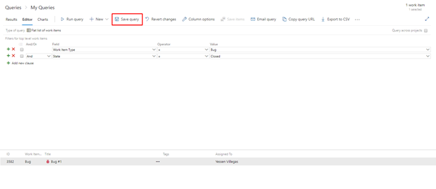

## **TIP A TENER EN CUENTA**

Cuando creamos queries es posible crearlas desde un proyeto, pero buscando la información desde otro, por ejemplo:
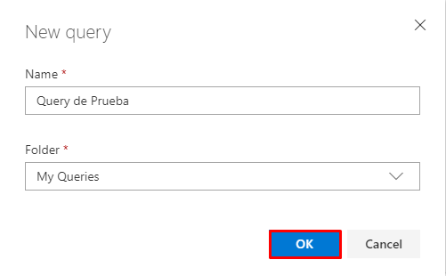

En la imagen anterior observamos varios Proyectos, yo he estado trabajando siempre desde el proyecto QA, desde allí voy a hacer queries a otro proyecto de la siguiente manera:

1. Ingresamos nuevamente a la creación de una nueva Query:
   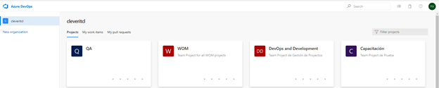
2. En la parte superior izquierda seleccionar el check “Query across projects”
   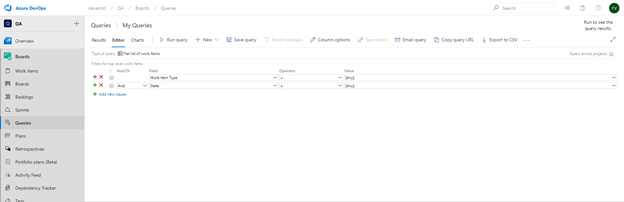
3. Ingresar un nuevo parámetro de la query para agregar el Proyecto
   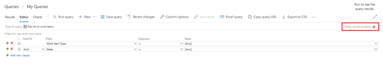
4. Agregar el campo “Team Project”
   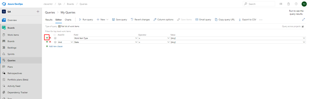
5. Y seleccionar el valor que corresponda del proyecto cross que deseemos buscar:
   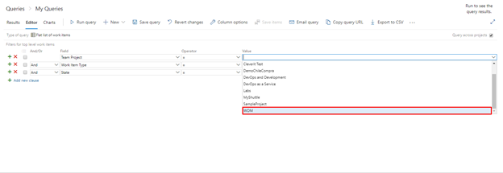

### **Y el resto, es historia!**

**_Esto nos sirve para tener en un mismo Dashboard información de diferentes proyectos_**
