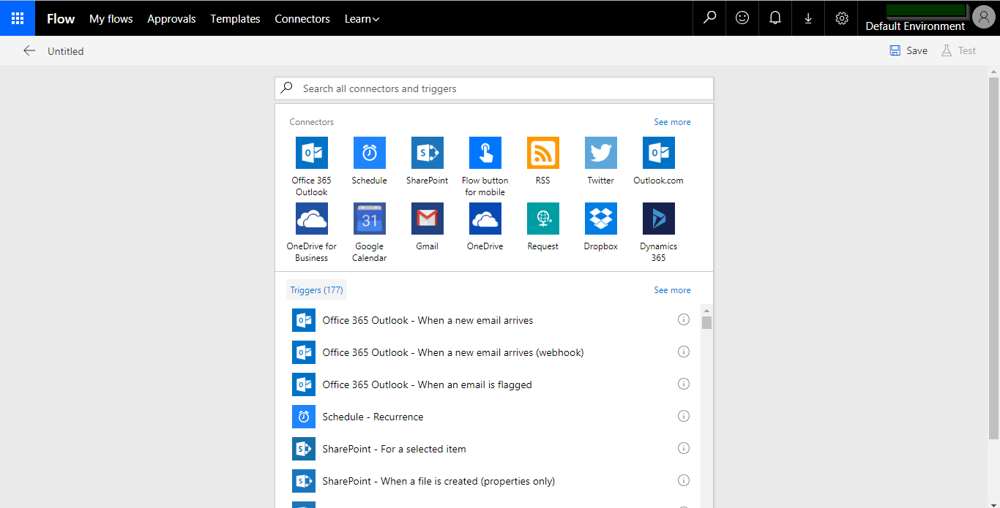

# **MS Flow**

Microsoft Flow es un software basado en la nube que permite crear y automatizar flujos de trabajo y tareas en múltiples aplicaciones y servicios sin la ayuda de los desarrolladores. Los flujos de trabajo automatizados se denominan flujos. Para crear un flujo, el usuario especifica qué acción debe llevarse a cabo cuando ocurre un evento específico.

## **Características de MS Flow**

Microsoft Flow no solo se integra con otros productos de Microsoft. Se puede usar con una amplia variedad de aplicaciones y servicios, lo que Microsoft llama conectores, incluidos Azure DevOps, Salesforce, SQL Server, Twitter, Box, DocuSign, Slack, Skype y Google Drive. Un conector es un proxy de API que permite que estos servicios se conecten a Microsoft Flow, así como a PowerApps y Azure Logic Apps, en la nube.

Los usuarios pueden aprovechar una amplia biblioteca de flujos preconstruidos, también conocidos como plantillas. Las plantillas de ejemplo incluyen la capacidad de:

- Guardar archivos adjuntos de Gmail en OneDrive
- Envíe un correo electrónico a cualquier audiencia cuando se active una alerta de datos de Power BI
- Copie los elementos de la lista de SharePoint en un Csv cada semana
- Guardar tweets que incluyen un hashtag específico en una lista de SharePoint
- Recibe una notificación automática cuando recibas un correo electrónico de tu jefe

Si ninguna de las plantillas se ajusta al proceso que necesita ser automatizado, los usuarios también pueden hacer sus propios flujos. Microsoft Flow está diseñado para que el personal no técnico pueda automatizar los flujos de trabajo sin la ayuda de un desarrollador. El Centro de administración de Microsoft Flow permite a un administrador administrar usuarios, permisos y roles y garantizar que los flujos creados por los empleados cumplan con las políticas de prevención de pérdida de datos.

## **Crear flujo usando una plantilla.**

Una vez que inicie sesión, recibirá una página de inicio que muestra una lista de las plantillas destacadas de Microsoft Flow. Aquí, puede elegir crear un nuevo flujo utilizando cualquiera de estas plantillas.

## **Crear un flujo desde cero**

Si no puede encontrar una plantilla que se adapte a sus necesidades, puede crear un flujo desde cero. Haga clic en la pestaña Mis flujos y luego seleccione la opción Crear desde en Cero.

Será llevado a una página desde donde puede crear un flujo personalizado. Aquí, puede ver una demostración de video de cómo crear un flujo personalizado o comenzar a crear uno haciendo clic en la opción Crear desde Cero. En la parte inferior, también verá una lista de algunos de los desencadenantes más populares que puede usar para crear su flujo.

Al hacer click en la opción crear desde cero, se abre una página donde puede seleccionar conectores y acciones para crear su flujo. Crearemos un flujo para enviarnos un correo electrónico a través de Office 365 Outlook cada vez que se modifique un work ítem en el Azure DevOps. Por lo tanto, seleccionaremos el conector de Azure Devops, elegiremos el activador "Cuando se modifica work item" y especificaremos la acción como enviar un correo electrónico a Office 365 Outlook.

Cuando busque el planificador, verá el conector del planificador y los posibles desencadenadores y acciones. Queremos comenzar son Flow cuando se modifica un work item. Por lo tanto, seleccione el activador cuando se actualiza un work item.

En el desencadenador podremos observar datos que son obligatorios, para el caso de este, nos pide un nombre de la cuenta, el cual sería WomChile y un nombre del proyecto en el cual se encuentra el WI.

Según este flujo, cuando se actualice un WI del tipo BUG en el Azure DevOps CleveritCL dentro del team Project WOM va a desencadenar una acción.

Luego, hacemos clic en +Nuevo Paso y elegimos una acción. En este caso, seleccionaremos Enviar un correo electrónico.

Llenamos los campos obligatorios que serian el email al cual se enviara dicho correo, el asunto que llevara y que debe llevar en el cuerpo.

Como se logra detallar en la imagen se pueden usar variables tanto del desencadenante como de las acciones. En este ejemplo el correo se enviara a Rbellina, el asunto contendrá el título del WI mas un texto que indique que fue modificado y el cuerpo llevara el titulo del WI y por quien fue modificado.

Por último se debe guardar en la parte de arriba a la derecha.

## **Como probar un Flow**

Para probar un flujo, en la misma pantalla de edición o creación de flujos se debe dar click en el botón de probar arriba a la derecha, el cual nos permite reutilizar una prueba anterior o crear una nueva prueba.

## **Ejemplo de prueba**

