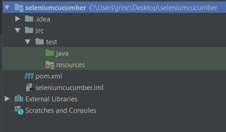

## Conceptos básicos:

**Selenium:** Es un framework de automatización de pruebas para entorno web y aplicaciones mobile.
**Cucumber:** Es un framework que permite el desarrollo BDD (Behaviour Driven Depelopment), permitiendo escribir tests en lenguaje Gherkins
Para aprender más de Cucumber click en el siguiente link —> https://cucumber.io/docs/guides/
**Gherkins:** Lenguaje de alto nivel que permite la escritura de tests basados en escenarios, los archivos Gherkins tendrán extensión .feature
Para aprender más acerca de Gherkins click en el siguiente link —> https://cucumber.io/docs/gherkin/

## Herramientas a instalar localmente en la máquina donde se correrán los tests:

- Java JDK
- Maven
- Geckodriver
- Internet Explorer Webdriver si se amerita (https://docs.seleniumhq.org/download/ )

**Nota:** Es preferible que todo se instale a través de instalador de paquetes de línea de comando, para que las variables de entorno sean configuradas en el momento en que se instalan los paquetes. Para Windows existe Chocolatey y para Mac homebrew

Para configurar el webdriver de IE es necesario pasarle como parámetros de configuración el directorio donde se encuentra el .exe, quedando de la siguiente manera:

`System.setProperty("webdriver.ie.driver","c:\\Users\\jrinc\\Desktop\\IEDriverServer.exe");`

También se debe habilitar el Modo Protegido para el navegador. Esto se hace abriendo internet explorer, botón de configuración, luego ir a opciones de internet, luego Seguridad y habilitar modo protegido para Internet, Intranet Local, Sitios de Confianza y Sitios Restringidos

## Dependencias Maven utilizar:

- junit
- cucumber-java
- cucumber-junit
- selenium-java
- maven-compiler-plugin

## Herramientas de trabajo:

Algún IDE de tu preferencia (también se puede usar vim)

Ahora sí, comencemos, y esto se hace generando un proyecto Maven desde 0 a través del IDE.

El archivo pom.xml debe quedar de la siguiente manera:

```xml
<?xml version="1.0" encoding="UTF-8"?>
<project xmlns="http://maven.apache.org/POM/4.0.0"
         xmlns:xsi="http://www.w3.org/2001/XMLSchema-instance"
         xsi:schemaLocation="http://maven.apache.org/POM/4.0.0 http://maven.apache.org/xsd/maven-4.0.0.xsd">
    <modelVersion>4.0.0</modelVersion>

    <groupId>Seleniumcucumber</groupId>
    <artifactId>seleniumcucumber</artifactId>
    <version>1.0-SNAPSHOT</version>

    <properties>
        <cucumber.version>4.2.6</cucumber.version>
        <project.build.sourceEncoding>UTF-8</project.build.sourceEncoding>
    </properties>

    <dependencies>
        <dependency>
            <groupId>io.cucumber</groupId>
            <artifactId>cucumber-java</artifactId>
            <version>${cucumber.version}</version>
            <scope>test</scope>
        </dependency>

        <dependency>
            <groupId>io.cucumber</groupId>
            <artifactId>cucumber-junit</artifactId>
            <version>${cucumber.version}</version>
            <scope>test</scope>
        </dependency>

        <!-- https://mvnrepository.com/artifact/junit/junit -->
        <dependency>
            <groupId>junit</groupId>
            <artifactId>junit</artifactId>
            <version>4.13-beta-3</version>
            <scope>test</scope>
        </dependency>

        <dependency>
            <groupId>org.seleniumhq.selenium</groupId>
            <artifactId>selenium-java</artifactId>
            <version>3.141.5</version>
        </dependency>

        <!-- https://mvnrepository.com/artifact/commons-io/commons-io -->
        <dependency>
            <groupId>commons-io</groupId>
            <artifactId>commons-io</artifactId>
            <version>2.6</version>
        </dependency>
    </dependencies>

    <build>
        <plugins>
            <plugin>
                <groupId>org.apache.maven.plugins</groupId>
                <artifactId>maven-compiler-plugin</artifactId>
                <version>3.7.0</version>
                <configuration>
                    <encoding>UTF-8</encoding>
                    <source>1.8</source>
                    <target>1.8</target>
                </configuration>
            </plugin>
        </plugins>
    </build>
</project>
```

El directorio en donde se ubicarán los archivos a crear se visualizará de la siguiente manera:



En la carpeta java se ubicarán los archivos con extensión .java, las clases en donde desarrollaremos nuestros StepsDefinitions (las acciones que tendrá cada paso de los Gherkins) y la clase en donde se enviarán los parámetros necesarios para correr los tests.

En la carpeta resources se ubicarán los archivos con extensión .feature, es decir, los Gherkins que contendrán el paso a paso de lo que se ejecutará en el Test

Realizaré un ejercicio corto, para demostrar el paso a paso y cómo funciona cucumber junto con selenium. Para esto comenzaremos con el Gherkins

**File: RunCucumberTest**

```java
package google;

import cucumber.api.CucumberOptions;
import cucumber.api.junit.Cucumber;
import org.junit.runner.RunWith;

@RunWith(Cucumber.class)
@CucumberOptions(glue = {"google"},
        features = "src/test/resources/google.feature",
        tags = {"@GoogleSearchCat"})
public class RunCucumberTest {
}
```

Dentro de esta clase se declara la ruta en donde se encuentran los archivos .feature y se declaran los tags que hayan sido definidos dentro de los escenarios o features de los Gherkins. También se especifica la ruta en donde están los step definitions, en nuestro caso es un package llamado google.

**File: Google.feature**

```java
Feature: Google Search

  @GoogleSearchCat
  Scenario Outline: Search cats
    Given I have Google Search url
    When I fill "<Search>" field
    And I press enter key
    Then I see many little cats and "<Search>" in search head

    Examples:
    | Search    |
    | Gato azul |
```

La tabla de examples nos define la cantidad de veces que correrá el test, ejemplo, si Examples tiene 4 filas es porque se le enviará 4 veces parámetros distintos y el test se ejecutará 4 veces, 1 por cada parámetro. Dentro del Gherkins se pueden definir Tags para los escenarios o para cada feature, a la hora de correr los tests uno envía el tag por parámetro y solamente se corre el test perteneciente a ese TAG.

**File: Google.java**

```java
package google;

import cucumber.api.java.After;
import cucumber.api.java.en.And;
import cucumber.api.java.en.Given;
import cucumber.api.java.en.Then;
import cucumber.api.java.en.When;
import org.junit.Assert;
import org.openqa.selenium.By;
import org.openqa.selenium.Keys;
import org.openqa.selenium.WebDriver;
import org.openqa.selenium.WebElement;
import org.openqa.selenium.firefox.FirefoxDriver;

public class Google {
    WebDriver driver = new FirefoxDriver();
    private WebElement searchInput;
    private WebElement searchHead;

    @Given("I have Google Search url")
    public void i_have_google_search_url(){
        driver.get("https://www.google.com");
    }

    @When("I fill {string} field")
    public void i_fill_search_field(String search){
        searchInput = driver.findElement(By.cssSelector("input[class='gLFyf gsfi']"));
        searchInput.sendKeys(search);
    }

    @And("I press enter key")
    public void i_press_enter_key(){
        searchInput.sendKeys(Keys.ENTER);
    }

    @Then("I see many little cats and {string} in search head")
    public void i_see_search_head(String search){
        searchHead = driver.findElement(By.cssSelector("input[class='gLFyf gsfi']"));
        Assert.assertEquals(searchHead.getAttribute("value"), search);
    }

    @After
    public void closeDriver() {
        driver.close();
    }
}
```

En esta clase definimos las acciones de cada uno de los steps, para la definición de las acciones nos ayudamos de Selenium y CSS selector para poder seleccionar los elementos web, en esta clase también realizamos las comparaciones para definir cuándo un test está correcto o incorrecto. Se instancia el driver y también se definen las acciones que se realizarán antes y después de ejecutar el test (@after y @before)

Como nota y buen estándar se espera que los elementos sean seleccionados por ID.

## Ejecutando los tests:

Para ejecutar los tests basta con escribir la siguiente línea de comando dentro del proyecto

`mvn test -Dcucumber.options="--tag @GoogleSearchCat"`

si se desea correr todos los tests, el comando sería el siguiente:

`mvn test`

Este framework que hemos podido apreciar es amigable y entendible. Inclusive los Gherkins al ser un lenguaje de alto nivel, es entendible para cualquier persona que los lea. Lo que se espera es que en un futuro sean involucrados todas las partes del equipo que forma parte del desarrollo del Producto, que la “realización de los Gherkins” no sea responsabilidad del QA, sino que vaya más allá, que éstos sean basados en los Criterios de Aceptación que tenga algún desarrollo en particular, que lo pueda escribir el Dueño del Producto o un Analista Funcional. Cabe destacar que cucumber puede ser usado con distintos lenguajes de programación, yo usé Java para este ejemplo, pero tu decides cuál lenguaje es el que te va mejor.

Espero haber sido de aporte con este pequeño artículo, siempre es más rentable, efectivo y rápido el automatizar procesos. Utilicemos la manía que tenemos todos los QA por lograr una mejor calidad en cada uno de los módulos, arquitecturas, aplicaciones o sistemas que testeamos, enfoquémonos en optimizar al máximo nuestro tiempo automatizando los casos que son más tediosos y repetitivos en cada ciclo de pruebas, creemos un mejor Sistema, participemos desde el modelado de la arquitectura hasta las pruebas de Stress. Hagamos de nuestro trabajo un proceso menos manual y manos a la obra que todo se puede lograr.
