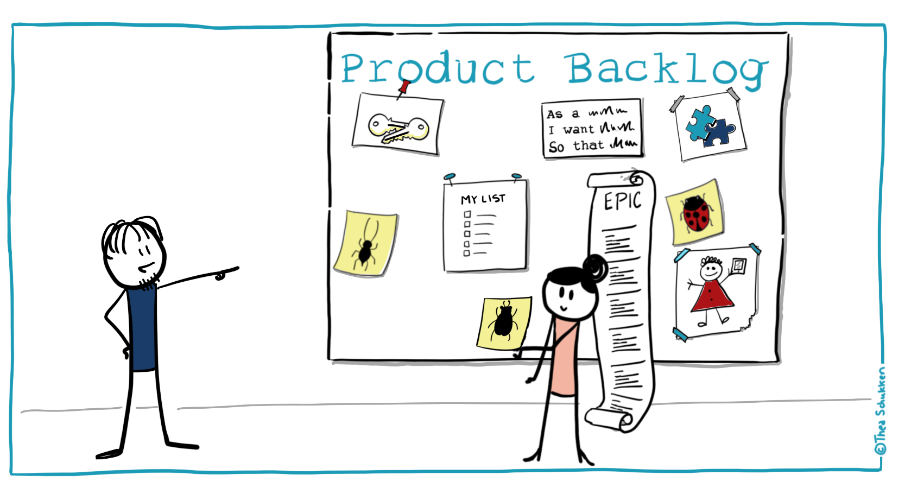
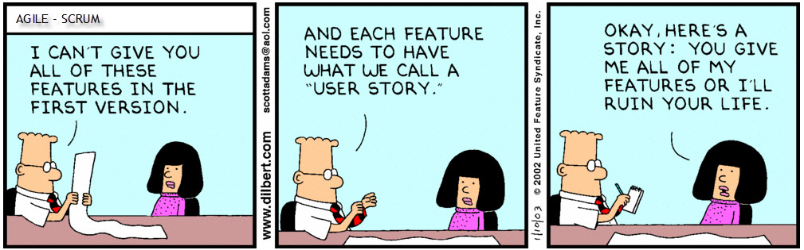

# ¿Cómo involucrar al usuario en Scrum?

Scrum conoce 3 roles: Product Owner, Development Team y Scrum Master. Las personas ajenas al Scrum Team se consideran "Stakeholders".

A menudo, los Stakeholders no tienen una idea clara de qué tipo de papel pueden desempeñar. Hay diferentes guías que tratan sobre este mismo tema y que pueden aclarar esto.

Cada entorno Scrum es diferente, por lo que no existe una respuesta clara que se aplique a todas las situaciones. Por lo tanto, discutiremos las diferentes opciones para buscar la mejor opción.

**El usuario .** Esta es la persona que hará uso del producto que está siendo creado y entregado por el Scrum Team.

Un Scrum Team puede tener miles de usuarios potenciales, otro equipo solo puede tener unos cuantos usuarios. Los Scrum Teams pueden tener usuarios internos, pero también pueden ser externos de la empresa o una combinación de usuarios internos y externos. Todo esto determina el lugar de los usuarios dentro de Scrum.

# El propósito de Scrum

**Scrum es:**
“Un marco de trabajo por el cual las personas pueden abordar problemas complejos adaptativos, a la vez que entregar productos del máximo valor posible productiva y creativamente ”. - Scrum Guide 2017, Schwaber y Sutherland

Como usuario, puede ayudar a determinar este valor. Si este es el caso, es probable que sus comentarios sean altamente valorados. Así es como un usuario puede desempeñar un papel.

# Sprint Review

La forma más lógica para que un usuario se involucre es en el Sprint Review.
El Sprint Review tiene que ver con comentarios y discusiones con las partes interesadas:
“Durante el Sprint Review, el Scrum Team y los interesados colaboran acerca de lo que se hizo durante el Sprint. Basándose en esto y en cualquier cambio al Product Backlog durante el Sprint, los asistentes colaboran para determinar las siguientes cosas que podrían hacerse para optimizar el valor. ”- Scrum Guide 2017, Schwaber y Sutherland

De acuerdo con la Guía Scrum, no todas las partes interesadas son invitadas automáticamente:
"Los asistentes incluyen el Scrum Team y las partes interesadas clave invitadas por el propietario del producto" - Scrum Guide 2017, Schwaber y Sutherland

Cada Product Owner tiene una opinión diferente sobre a quién ve él como parte interesada clave para invitar a la Sprint Review.

Dicho esto: Scrum es un entorno donde la transparencia, la inspección y la adaptación son vitales. Mi postura personal es que siempre es aconsejable invitar a los usuarios que deseen contribuir y dar su opinión de forma positiva y constructiva, ya que este es el objetivo de una Sprint Review.

Puede que no siempre sea práctico invitar a los usuarios. Como ejemplo: puede haber demasiados usuarios para ser invitados a un Sprint Review. Los Scrum Teams podrían buscar otras formas de recibir comentarios. Estas otras formas son prácticas que podrían ser complementarias de Scrum, pero que no forman parte del framework de Scrum.

Durante el Sprint Review, las partes interesadas, que pueden incluir a los usuarios, ayudan a determinar qué hacer a continuación. Esta es información importante para el próximo Sprint Planning. Como parte interesada, el usuario también brinda feedback sobre los desarrollos en el mercado y, muy probablemente, brinda feedback sobre el uso del producto. Esto influye en lo que es lo más valioso qué hacer a continuación. El usuario también puede tener puntos de vista importantes sobre las próximas versiones anticipadas de funcionalidad o capacidad del producto.

# Sprint Planning

El Sprint Planning es el evento en el que el Scrum Teams determina el objetivo del Sprint y el trabajo que se realizará para lograr este objetivo. Probablemente sea muy raro que se solicite a una parte interesada del tipo de usuario que esté presente y que ayude con esto.

# Daily Scrum

Daily Scrum es un evento para el Development Team. Esta es la parte del Scrum Team que crea un incremento potencialmente liberable del producto. En el Daily Scrum planean el trabajo para las próximas 24 horas. Si hay otros presentes, no deben interrumpir este evento:
“El Daily Scrum es una reunión interna para el equipo de desarrollo. Si hay otros presentes, el Scrum Master se asegura de que no interrumpan la reunión. ”- Scrum Guide 2017 Schwaber y Sutherland

Esto se aplica al Product Owner, al Scrum Master y a las partes interesadas.

# Sprint Retrospective

El Sprint Retrospective es un evento interno para que el Scrum Team se inspeccione y planifique mejoras. Los Scrum Teams abordan lo que salió bien, pero también lo que necesita mejoras en las personas, las relaciones, los procesos y las herramientas. Esto exige un entorno que les permita sentirse seguros para ser efectivos. Esta es la razón por la cual esto generalmente no es un lugar para la parte interesada, que incluye a los usuarios.

# Refinement

Existen mejoras para hacer que los elementos de la Lista de pedidos estén listos para ser recogidos en un Sprint. Puede ser una buena idea invitar a las partes interesadas, para aclarar lo que se necesita.

Tener usuarios que ayuden con el refinamiento puede aumentar la energía y el entusiasmo del Scrum Team cuando son testigos de que pueden mejorar la vida diaria de alguien.

# Fuera de los eventos Scrum

Hay vida fuera de los eventos de Scrum. Y hay todo tipo de formas informales para interactuar con el Scrum Team. Un usuario puede interactuar con un Product Owner para discutir cómo maximizar el valor del producto. Un usuario también puede comprometerse con el Development Team para proporcionar comentarios sobre lo que se está creando. Cómo se hace todo esto depende de los Scrum Teams que eligen la mejor manera de realizar su trabajo.

# El usuario como Product Owner

Es completamente posible que un usuario sea un Product Owner adecuado, responsable de maximizar el valor del producto resultante del trabajo del Development Team. No es raro que un usuario de un producto sea la mejor elección para este rol. Como ejemplo: un miembro del equipo de finanzas podría convertirse en el Product Owner para el nuevo producto de facturación.

# El usuario como miembro del Development Team

También es posible tener uno o más usuarios como parte del Development Team para ayudar a construir un incremento de producto potencialmente liberable. Los Development Teams son multifuncionales. Los usuarios podrían estar jugando un papel importante para ayudar a construir un incremento. Como ejemplo: nuestra organización tiene un Scrum Team para ayudar a mejorar los procedimientos organizacionales. Muchos de nosotros somos usuarios activos de estos procedimientos organizacionales.

# Conclusión

Scrum es un framework que es adecuado para una amplia variedad de entornos. Un Scrum Team podría tener unos cuantos usuarios, otro podría tener miles. Algunos equipos tienen usuarios internos, otros tienen usuarios externos o una combinación de usuarios internos y externos. Estos son factores que determinan el lugar de los usuarios dentro de Scrum.

Es muy importante tener en cuenta qué Scrum es un framework para entregar productos del mayor valor posible. Hay muchas formas de evaluar el valor del producto o partes del producto. Una de estas formas es involucrando al usuario. Ahora depende de usted, junto con el Scrum Team, encontrar la mejor manera de lograr esto.
