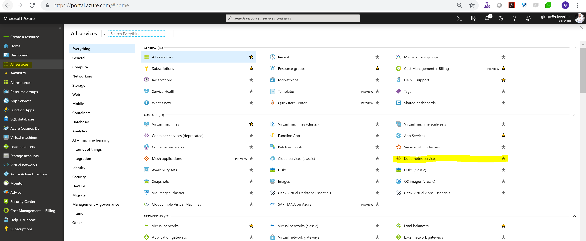
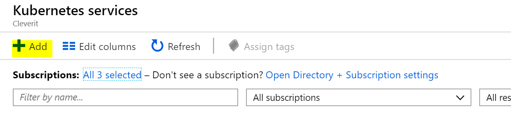
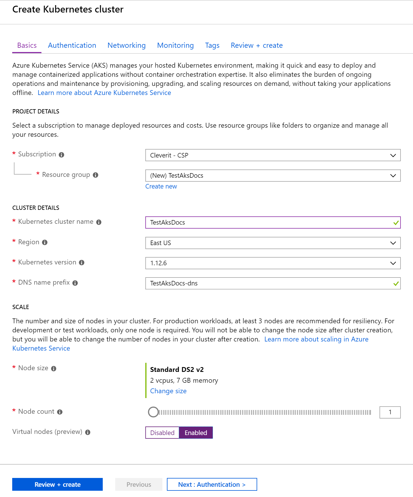
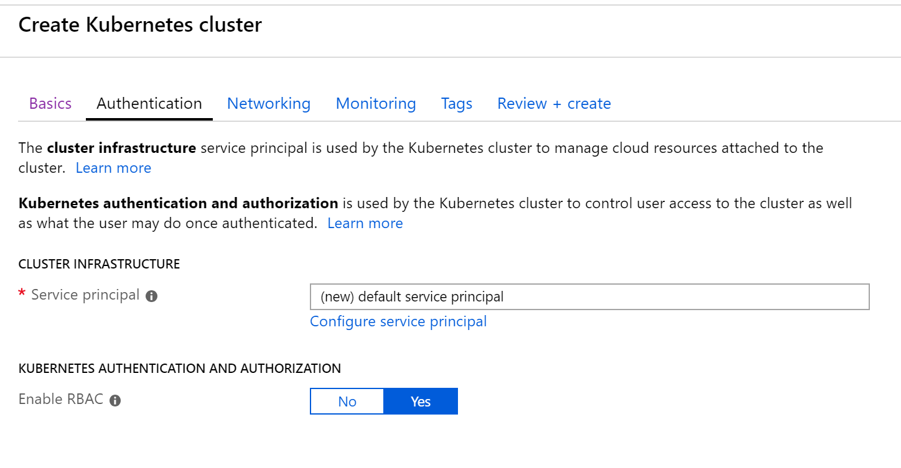
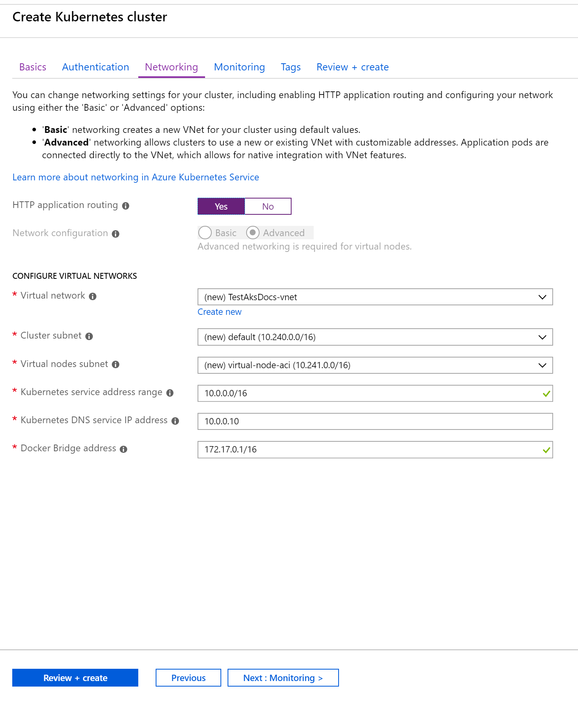
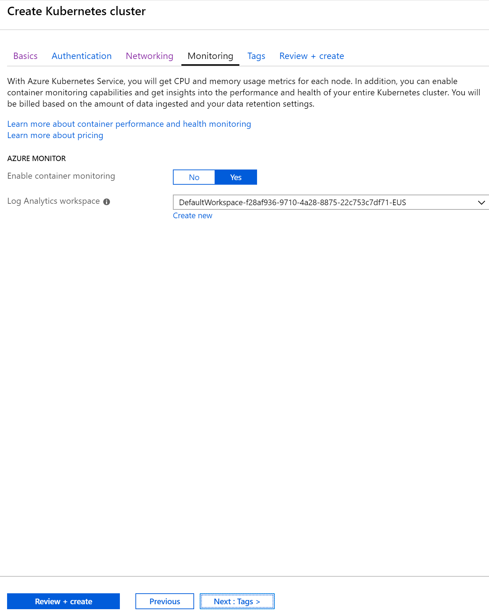
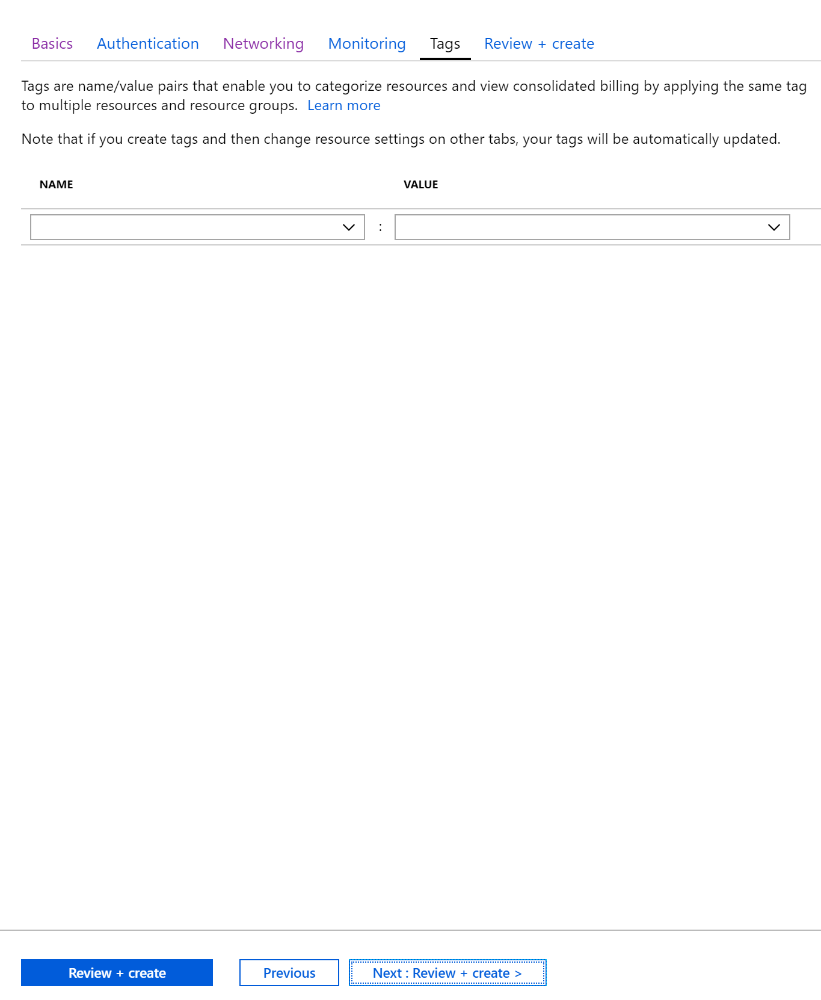
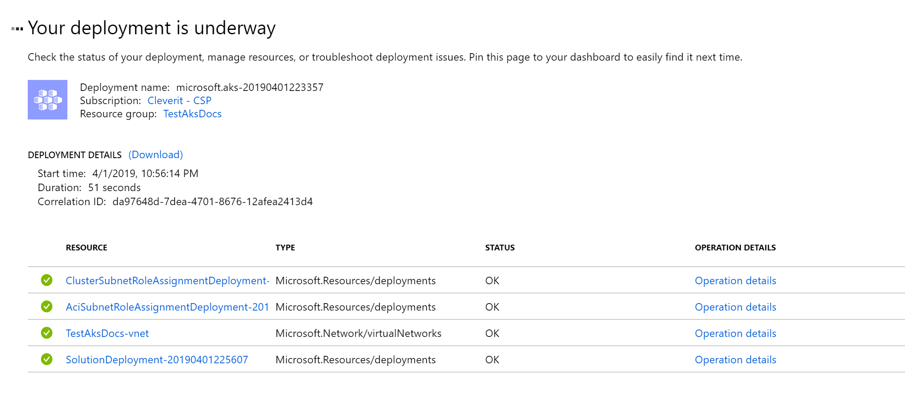
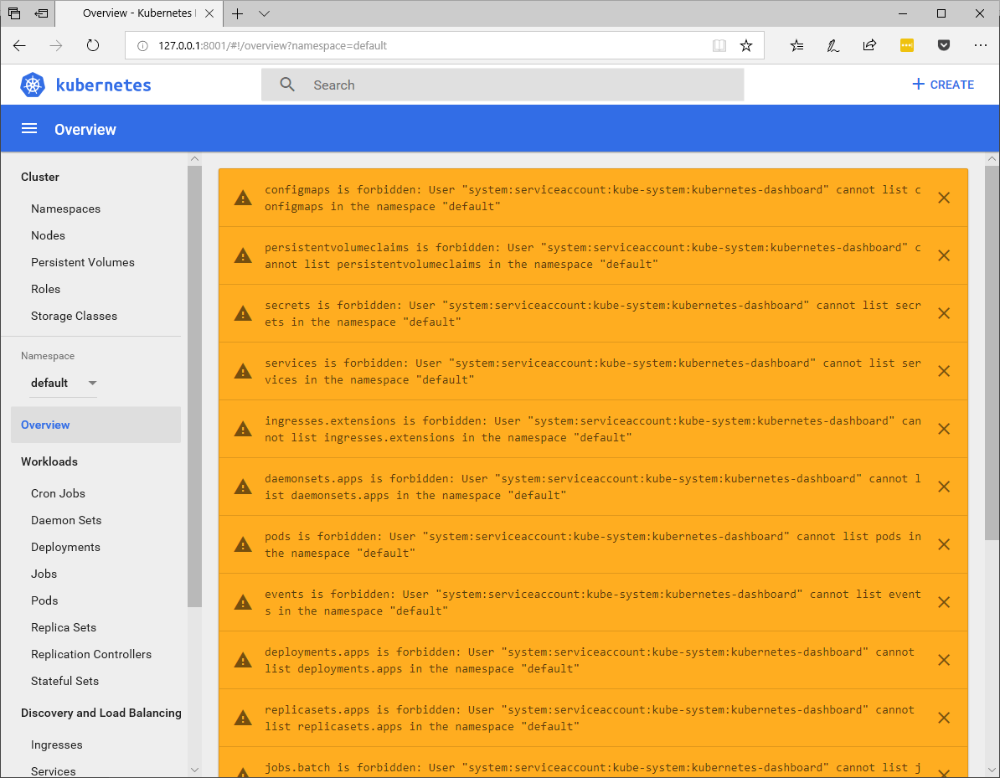

# **Azure Kubernetes Services**

Para trabajar con Azure Kubernetes services se necesita cumplir con ciertos pre requisitos:

- Poseer una cuenta MS ([Personnal Account](https://support.microsoft.com/en-us/help/4026324/microsoft-account-how-to-create) o Work Account).
- Poseer una suscripción de [Azure](http://portal.azure.com).
- Tener la disposición y ganas de aprender!

# **¿Como crear el Cluster?**

Para crear un cluster existen dos alternativas:

1. A través de interfaz web. [(Portal)](https://docs.microsoft.com/en-us/azure/aks/kubernetes-walkthrough-portal)
2. A través de linea de comandos [(CLI)](https://docs.microsoft.com/en-us/azure/aks/kubernetes-walkthrough).

A continuación, se detallará el paso a paso para crear el cluster AKS:

## **Interfaz Web:**

Para crear un Cluster de **Azure Kubernetes Services** se debe ingresar a Azure a través de la URL http://portal.azure.com. `Debe ingresar con la cuenta que tenga una suscripción activa`.

Luego de ingresar a Azure debe hacer click en "_**All services**_" y luego en "_**Kubernetes Services**_"



Luego al abrir la próxima ventana debes hacer click en "**_add_**



Al mostrar la siguiente imagen, se debe completar el formulario de los campos solicitados:

- **Subscription:** Nombre de la suscripción donde se aplicará el consumo.
- **Resource Group:** Nombre del grupo de recursos. `Se recomienda separar el grupo de recursos ya que agrupará los servicios del AKS y podrá agrupar gastos relacionados al servicio.`
- **Kubernetes Cluster name:** Nombre del cluster a crear.
- **Region:** Región donde se alojará el cluster.
- **Kubernetes Version:** Versión del Kubernetes a desplegar.
- **DNS name prefix:** Nombre del dns del cluster a desplegar.
- **Node Size:** Talla de la máquina que se desplegará. **`NOTA: Al crear el cluster no se puede cambiar el tamaño del nodo pero si se puede escalar en cantidad de máquinas o nodos.`**
- **Virtual nodes:** Si permite o no crear nodos virtuales.
  

Hacer click en "**_Next: Authentication >_**




Hacer click en **_Next: Networking >_**



Hacer click en **_Next: Monitoring >_**


Agregar los tags:

- **Name:** Llave
- **Value:** Valor de la llave:



Hacer click en **_Next: Review + Create >_**

En resumidas cuentas también se puede usar el **ARM** del siguiente link: [AKS.zip](https://1drv.ms/u/s!As3VWf_hoCLsi-VSWF-5hAdNhtZj1g?e=nTQswI).

Al hacer click en **_Next: Review + Create >_** se iniciará la creación de los servicios.



## **Una vez creado el AKS** debemos configurarlo:

```shell
az account list --output table
az account set --subscription $subscriptionID/Name
az account set --subscription $subscriptionID/Name
```

## **Pre requisito:**

- Tener instalado [az cli](https://docs.microsoft.com/en-us/cli/azure/install-azure-cli-windows?view=azure-cli-latest)
- Tener instalado [kubectl](https://docs.microsoft.com/es-es/azure/aks/kubernetes-walkthrough#connect-to-the-cluster) `az aks install-cli`

Para configurar _**kubectl**_ para conectarse al clúster de Kubernetes, usando el comando `az aks get-credentials`. Con este comando se descargan las credenciales y se configura la CLI de Kubernetes para usarlas.

**`Ejemplo:`**
**`az aks get-credentials --resource-group myResourceGroup --name myAKSCluster`**

Posteriormente se debe configurar los secrets del K8S:


**`kubectl create clusterrolebinding kubernetes-dashboard -n kube-system --clusterrole=cluster-admin --serviceaccount=kube-system:kubernetes-dashboard`**

Y por último se debe configurar el acceso del K8s al ACR ([Azure container registry](https://docs.microsoft.com/es-es/azure/container-registry/container-registry-get-started-portal)).

`az ad sp create-for-rbac --skip-assignment`

`az acr show --resource-group $ACR --name $Cleveritacr`

`az aks show --resource-group newgranaks --name clevergranaks --query "servicePrincipalProfile.clientId" --output tsv`

```
az role assignment create --assignee $IDACR --scope /subscriptions/f28af936-9710-4a28-8875-22c753c7df71
/resourceGroups/ACR/providers/Microsoft.ContainerRegistry/registries/Cleveritacr --role acrpull
```

Para abrir el navegador de Kubernetes:

`az aks browse --resource-group $resource-group --name $name`
