# Sonarqube Azure.

SonarQube es una plataforma para evaluar código fuente. Es software libre y usa diversas herramientas de análisis estático de código fuente como Checkstyle, PMD o FindBugs para obtener métricas que pueden ayudar a mejorar la calidad del código de un programa. Dicha herramienta es muy fácilmente se puede integrar con Azure o Jenkins.

## Requisitos

La herramienta Docker nos ha facilitado la configuración de los sistema, usando una imagen de docker fácilmente podemos comenzar a trabajar pero para esto es necesario tener unos pre requisitos.

- Windows 10 versión Professional o Enterprise.
- Updates críticos para Windows Containers.
- Virtualización activada en nuestro equipo.

Después de haber configurado nuestro ambiente de trabajo podríamos crear una imagen, para esto nos ayudaremos con la documentación oficial de Docker SonarQube https://hub.docker.com/_/sonarqube/

## Configuración

Como mencionamos anteriormente para poder agilizar la configuración del ambiente de trabajo para el sonarqube, utilizaremos una imagen de Docker. Con dicha imagen podremos tener acceso a la aplicación y podremos realizar todos los análisis del mismo modo que el tradicional.
Para para la creación de la imagen de Docker
• Tener el Docker en modo contenedor Linux.
• Abrir una ventana de comando ya sea powershell o cmd. Tener en cuenta que debe ser en modo administrador.
• Ejecutar el siguiente comando

```
  docker run -d --name sonarqube -p 9000:9000 sonarqube
```

• Correr la imagen de Docker.
• En un navegador ir a la aplicación con la siguiente URL.
**http://localhost:9000**

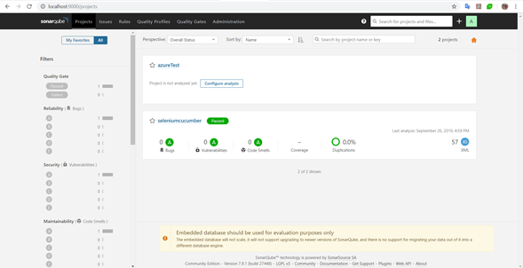

## Análisis de un proyecto

Existe dos métodos para poder realizar la inspección de código de un proyecto.
• Utilizando el terminal del IDE
• Con una herramienta de CI/CD como Azure o Jenkins.

Pasos para realizar un análisis:
• Crear un nuevo proyecto en sonarqube
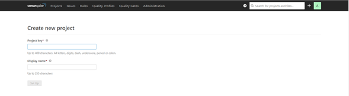
• Generar un nuevo token.
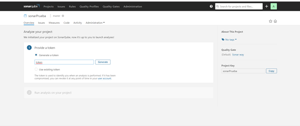

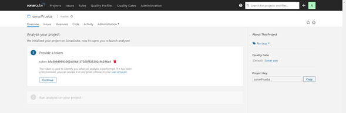

• Realizar click en continue
• Seleccionar el tipo de lenguaje que se encuentra el proyecto. Para este ejemplo utilizaremos un proyecto Java con Maven.


Nos aparecerá un script con el cual podremos realizar la inspección.
**NOTA: Este script lo necesitaremos tanto para la ejecución en el terminal del IDE como en el Azure.**

### Ejecución por el IDE

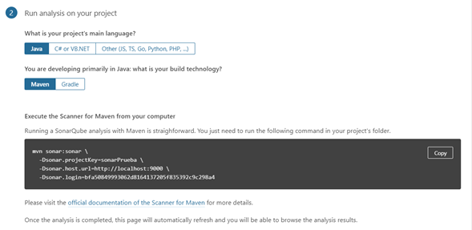

Se ejecuta el comando desde el terminal o por el Maven.

### Ejecución por el Azure.

- [ ] Se debe tener una máquina virtual en el azure con sonarqube instalado.
- [ ] Crear un proyecto en el servidor de sonarqube.

- [ ] Seguir los siguientes pasos para la creación del pipeline

1. Crear un nuevo pipeline
   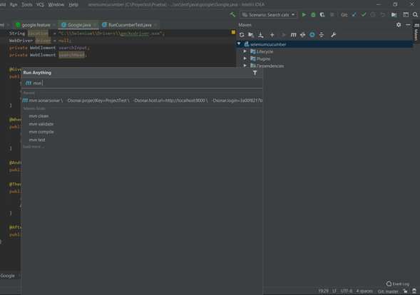

2. Seleccionar Other Git

3. Seleccionar un template. En nuestro caso seleccionaremos Maven
   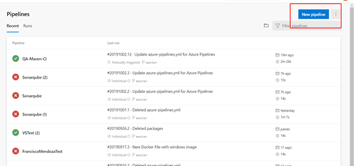
4. Agregaremos al job la tarea “Prepare analysis on sonarQube”. Hay que tener en cuenta que se debe tener la extensión de sonarqube instalada en el proyecto.
   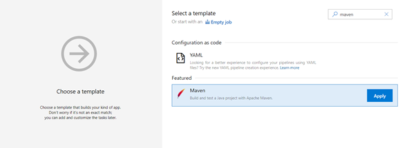
   **NOTA:** Se debe crear un nuevo servicio de conexión. Dicho servicio debe tener los datos del servidor de SonarQube, tener en cuenta los siguientes datos:

```
- Server URL.
- Token.
- Nombre del servicio.
```

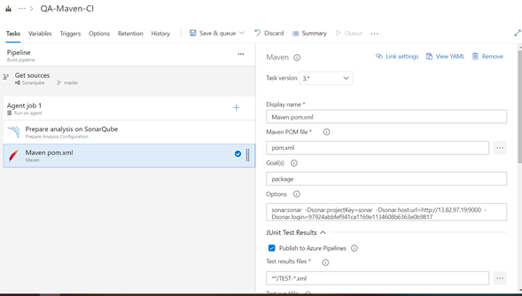

5. Se debe validar que en el radio button de “Integrate with Maven ir Grandle” debe estar chequeado.
6. En la tarea de Maven, se debe colocar el código que genera el SonarQube. Pero se tiene que quitar el **mvn** y los **Backslash** \
7. En la sección de Code Analysis seleccionar la opción “Run SonarQube or SonarCloud analysis”

## Funcionalidades del SonarQube

A continuación se mostrara un ejemplo de un análisis de un proyecto usando sonarQube
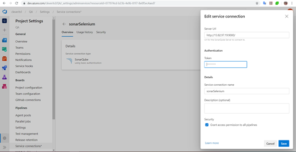

### Bugs & Vulnerabilities

Los errores o Vulnerabilidades son pequeñas fracciones de código que aun no se encuentran dañadas, pero representan unas futuras fallas.

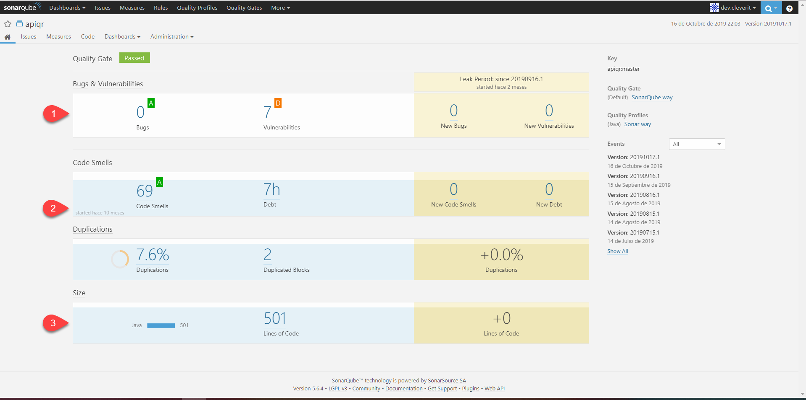

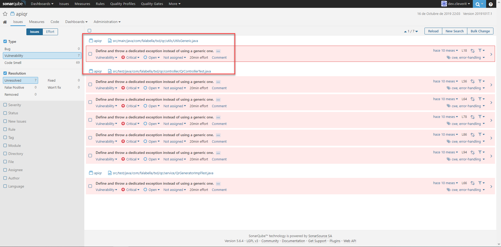

### Code Smell

Un problema relacionado con la mantenibilidad en el código. Dejarlo como está significa que, en el mejor de los casos, los programadores tendrán más dificultades de las que deberían hacer cambios en el código. En el peor de los casos, estarán tan confundidos por el estado del código que introducirán errores adicionales a medida que realicen cambios.

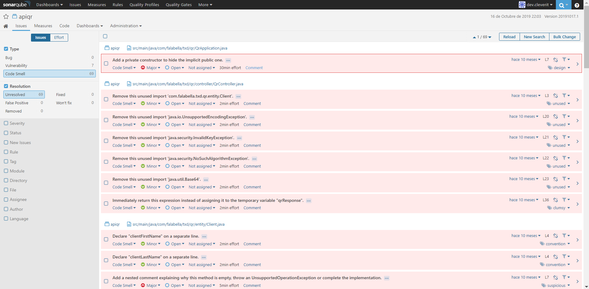
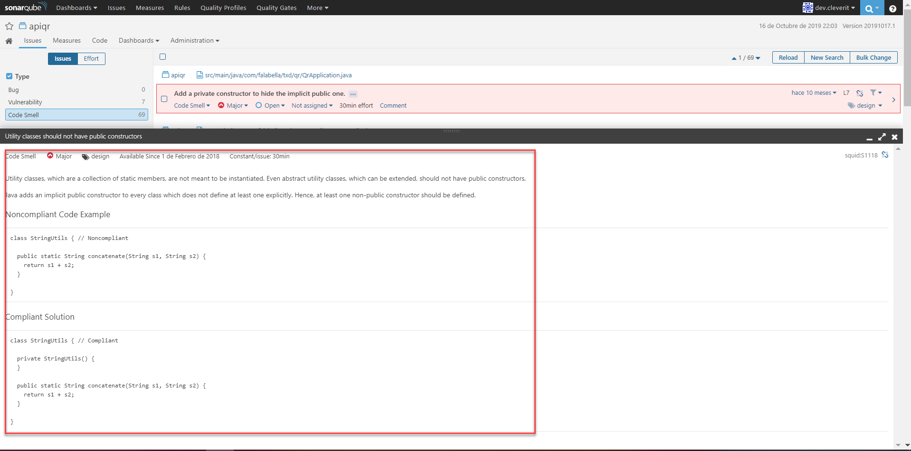

### Duplications

Como su nombre lo indica, en esta sección se muestra el código duplicado que se encuentra en el proyecto.

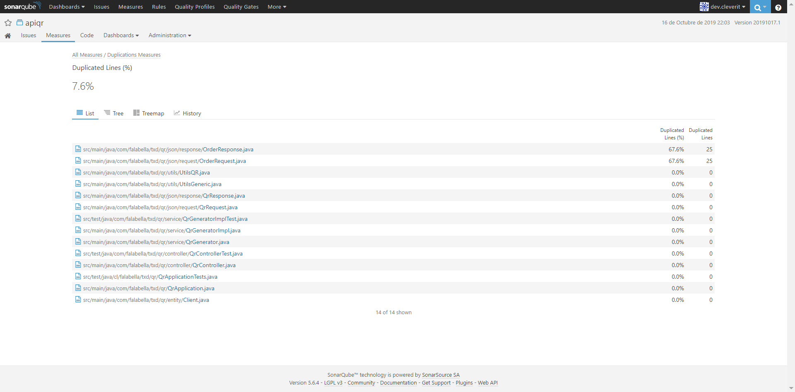

### Size

Muestra el tamaño del proyecto, aquí se desglosa el mismo y se puede visualizar la cantidad de líneas de código, funciones, archivos y clases existen.

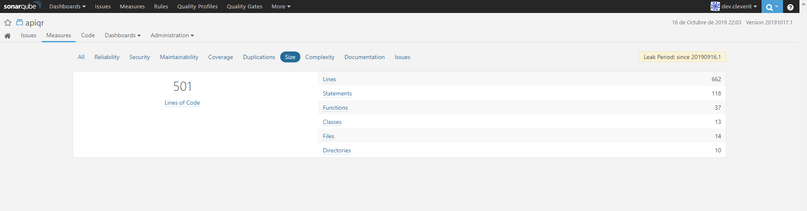

## Resumen

- Como se ha mencionado anteriormente, la instalación de SonarQube es muy sencilla usando Docker.
- Ayuda a crear un producto mas robusto.
- Hace que el codifico sea de fácil mantención.
- Fácil integración con Azure.
