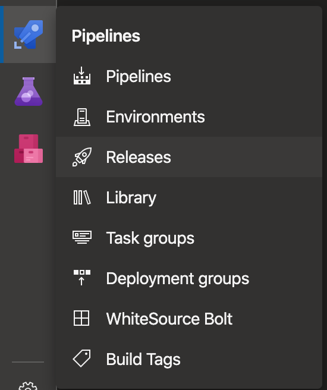
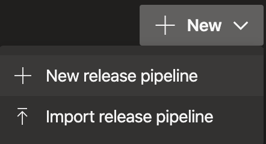
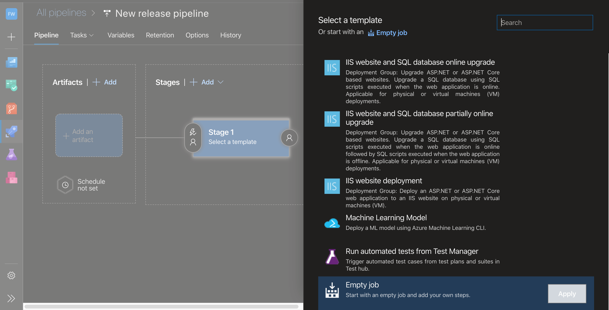
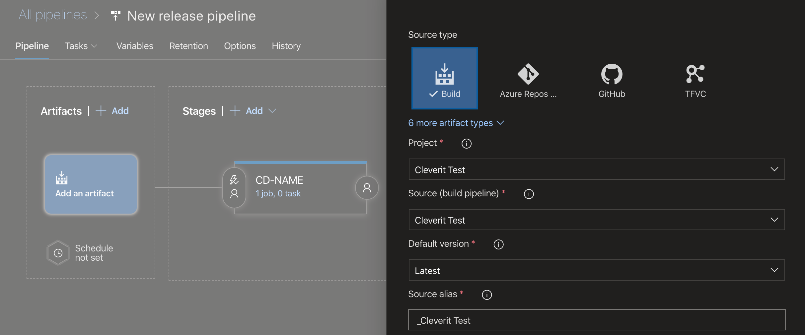
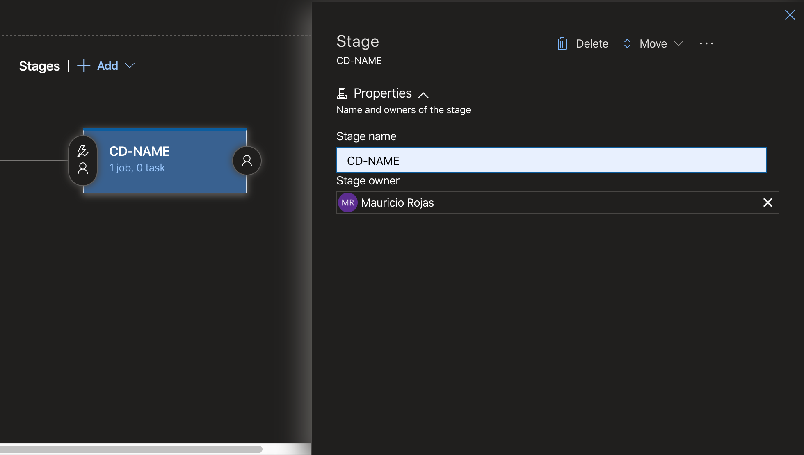
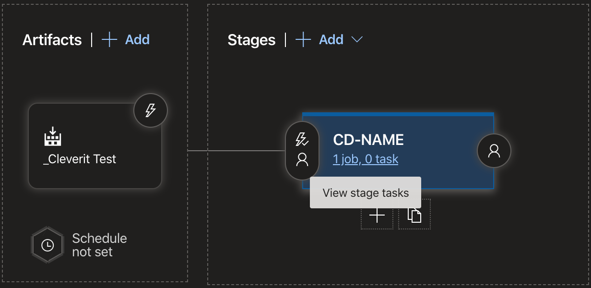
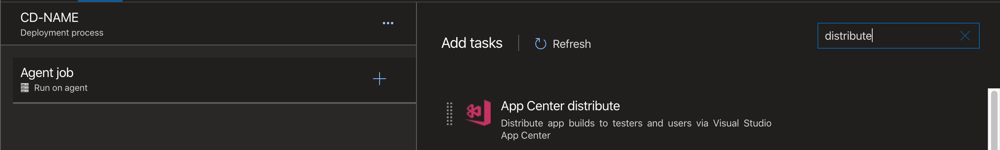
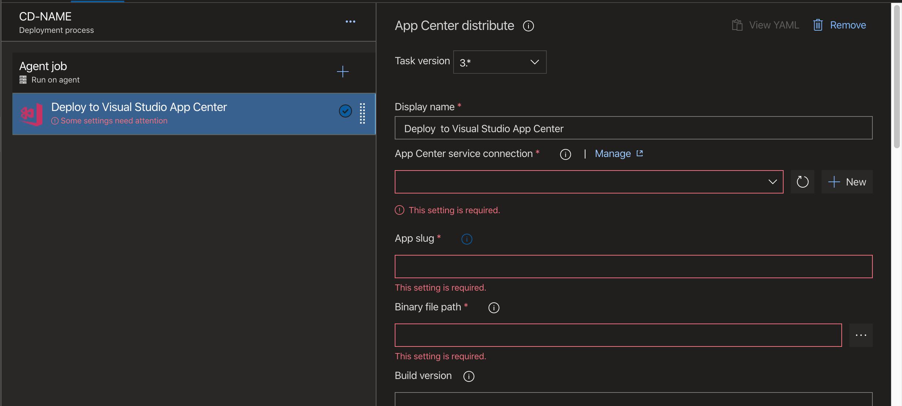

# Aprende a desplegar aplicaciones React Native Expo utilizando Azure DevOps y Appcenter


## ¿Estás aburrido de compilar tu aplicación React Native y Expo de manera local?

Sigue este tutorial y te ayudaré a realizar las prácticas de Integracion Continua (CI) y Despliegue Continuo (CD) utilizando Azure DevOps y App Center. Podrás realizar cambios en tu app y generar archivos IPA y archivos APK de forma rapida y segura.

Ahora veremos cómo realizar CI a través de [**Azure**](https://azure.microsoft.com/es-mx/free/search/?&ef_id=Cj0KCQiAz53vBRCpARIsAPPsz8UJUQfjMPCxTMywWpRUD0iH4oPAYTDc9nRwIN6T-GDK8BfnqOhQWCkaAjG2EALw_wcB:G:s&OCID=AID2000064_SEM_xdDHJvVZ&MarinID=xdDHJvVZ_324631778345_azure_e_c__66077598600_aud-394034018570:kwd-49508422&lnkd=Google_Azure_Brand&dclid=CjkKEQiAz53vBRDLpIeBmIfz6YwBEiQAG1b0WxDGHMO2EN5GJsrmpgyKTs_ocI9gO9uGtJz697QLtbjw_wcB 'Azure')

## Empezaremos con los elementos necesarios para realizar esta acción (solo iOS).

- Apple Team ID - (una cadena de 10 caracteres como "Q2DBWS92CA")
- Certificado de distribución archivo.p12 (+ contraseña)
- Perfil de aprovisionamiento

Para aprender cómo generarlos, te recomendamos consultar primeramente la guía sobre [Creación de aplicaciones independientes](https://docs.expo.io/versions/v35.0.0/distribution/building-standalone-apps/ 'Expo') .

<!-- Establezca la EXPO_IOS_DIST_P12_PASSWORD variable de entorno con el valor de la contraseña del Certificado de distribución. -->

Los certificados se pueden optener en [Apple Developer](https://idmsa.apple.com/IDMSWebAuth/signin?appIdKey=891bd3417a7776362562d2197f89480a8547b108fd934911bcbea0110d07f757&path=%2Faccount%2F&rv=1 'Apple').

Para descargar los certificados, primero debemos ir a la web de Apple Developer, iniciar sesión ahí y dirigirnos a [Membership] para optener el Apple Team ID [Membership](https://developer.apple.com/account/#/membership/Z95QWRLM3Z 'Membership') (Debes buscar una cadena de 10 caracteres como Ej:"Q2DBWS92CA").

En el caso del certificado p.12 primero debemos generarlo, por lo que nos dirigiremos ir al signo **(+)**.


En esa opción seleccionamos **In-House and Ad Hoc** y continuamos


Para descargar el Certificado.p12 vamos a [Certificates, ID, Profile](https://developer.apple.com/account/resources/certificates/list 'Certificates, ID, Profile') y buscamos el certificado que creamos y lo descargamos.

> Después de descargar el certificado debemos seguir unos pasos para generarlo. Para esto necesitaremos de un computador Apple.

## A. Crear un archivo CSR (.certSigningRequest)

1. Cliqueamos **Acceso a llavero**, se abre desde utilidades.
2. Desde la barra de herramientas de **Acceso a Llavero**, seleccionamos **Acceso a Llavero -> Preferencia**.
3. En la ventana emergente seleccionamos la pestaña **Certificados**.
4. Establecemos el **Protocolo de estado del certificado en línea** y la **Lista de revocación de certificados** en **Desactivado**.
5. Cerramos esta ventana.
6. Ahora, desde la barra de herramientas, abrimos **Acceso a llaveros -> Asistente de certificados -> Solicitar un certificado de una autoridad de certificación**.
7. Ingresamos la dirección de correo electrónico y el nombre común que utilizamos para registrarnos en el **Programa para desarrolladores de iOS**.
8. Mantenemos el correo electrónico de CA en blanco y seleccionamos **Guardado en disco** y **Permítame especificar la información del par de claves**.
9. Hacemos click en **Continuar**.
10. Elegimos un nombre de archivo y destino en nuestro disco duro.
11. Hacemos click en **Guardar**.
12. En la siguiente ventana, establecemos el valor de **Tamaño de clave** en **2048 bits**.
13. Establecemos **Algoritmo** en **RSA**.
14. Hacemos click en **Continuar**.

> Esto creará y guardará su archivo certSigningRequest (CSR) en su disco duro. También se creará una clave pública y privada en Keychain Access con el Nombre común ingresado.

## B. Crear el archivo ".cer" en la cuenta de desarrollador de iOS

1. Iniciamos sesión en la cuenta de desarrollador de Apple y hacemos click en **Certificados, identificadores y perfiles**.
2. Hacemos click en **Perfiles de aprovisionamiento**.
3. En la sección **Certificados** hacemos click en **Producción**.
4. Hacemos click en el botón **Agregar** **(+)** en la esquina superior derecha del panel principal.
5. Ahora, elegimos **App Store y Ad Hoc**.
6. Hacemos click en **Continuar**.
7. Hacemos click en **Elegir archivo** y buscamos el archivo CSR que hemos creado desde nuestro disco duro.
8. Hacemos click en **Generar**.
9. Hacemos click en **Descargar** para obtener el archivo.

#### C. Instalar .cer y generar el certificado .p12

1. Debemos encontrar el archivo .cer que hemos descargado y hacer doble click en él.
2. Establecemos el menú desplegable **Inicio de sesión** en **Inicio de sesión** y hacemos click en **Agregar**.
3. Abrimos KeyChain Access y encontramos el perfil creado en el _Paso A_.
4. Puedes expandir el perfil de **Clave privada** (muestra el certificado que agregamos).
5. Seleccionamos solo los dos certificados que creamos (no la clave pública).
6. Hacemos click derecho y luego click en **Exportar 2 elementos ...** en la ventana emergente.
7. Ahora debemos asegurarnos de que el formato del archivo sea **.p12** y elegir el nombre de archivo y el destino en nuestro disco duro.
8. Hacemos click en **Guardar**. Ahora, se nos pedirá establecer una contraseña, pero debemos mantener ambas en blanco.
9. Luego, hacemos click en **Aceptar**. Así, tendremos un archivo .p12 en nuestro disco duro.

[EJEMPLO](https://stackoverflow.com/questions/9418661/how-to-create-p12-certificate-for-ios-distribution 'EJEMPLO')

Con el Perfil de aprovisionamiento nos vamos a [Certificates, ID, Profile](https://developer.apple.com/account/resources/certificates/list 'Certificates, ID, Profile'), pero esta vez seleccionamos [Profiles](https://developer.apple.com/account/resources/profiles/list 'Profiles') y seleccionamos el signo de **(+)** para generar un nuevo perfil.


Una vez en la opción, nos vamos al área de **Distribution** y seleccionamos **In House** y continuamos. Después de la creación solo descargamos los certificados.

---

## CARGA ARCHIVOS SEGUROS

Con todo descargado nos vamos a Azure. En el proyecto creado, seleccionamos la opción **Pipelines** y a la opción siguiente: **Library**. Los documentos descargados son muy confidenciales, por lo que los cargaremos en el proyecto de forma segura. Para eso nos iremos a **Segure file** y después a **+Variable group**, donde subimos los archivos (Certificado.p12 y archivo.mobileprovision)

## CREACIÓN DE VARIABLE DE ENTORNO

Para cargar las variables de entorno, primero, debemos ir a la opción **Pipelines** y editamos el proyecto, después seleccionamos **Variables** después hacemos click en **(+)** y agregamos las variables de entorno.

### Variables de entorno necesarias

### Para reutilizar con éxito los archivos de configuración de CI, primero debemos configurar algunas variables de entorno:

- Común para todos los trabajos (no es necesario establecerlos si pasa el **--public-urlparámetro** al comando de compilación)

  - **EXPO_USERNAME** - El nombre de usuario de tu cuenta Expo.
  - **EXPO_PASSWORD** - La contraseña de tu cuenta Expo.

- Específico de Android. Puedes obtener estos valores de los servidores de Expo ejecutando **expo fetch:android:keystore** en el directorio de tu proyecto de Expo.

  - **EXPO_ANDROID_KEYSTORE_BASE64** - Almacén de claves de Android codificado en base64.

  - **EXPO_ANDROID_KEYSTORE_ALIAS** - Alias del almacén de claves de Android.

  - **EXPO_ANDROID_KEYSTORE_PASSWORD** - Contraseña del almacén de claves de Android.

  - **EXPO_ANDROID_KEY_PASSWORD** - Contraseña clave de Android.

- iOS específico. Puedes obtener estos valores de los servidores de Expo ejecutando **expo fetch:ios:certs** en el directorio de tu proyecto de Expo.

  - **EXPO_APPLE_TEAM_ID** - ID del equipo de Apple (una cadena de diez caracteres como "Q2DBWS92CA").

  - **EXPO_IOS_DIST_P12_BASE64** - Certificado de distribución iOS codificado en base64.

  - **EXPO_IOS_DIST_P12_PASSWORD** - Contraseña del certificado de distribución de iOS.

  - **EXPO_IOS_PROVISIONING_PROFILE_BASE64** - Perfil de aprovisionamiento iOS codificado en base64.

> En macOS, puedes codificar en base64 el contenido de un archivo y copiar la cadena al portapapeles ejecutando base64 some-file | pbcopyen un terminal.

---

## CODIGO PIPELINES

Primero partiremos con la carga de los archivos seguros y cómo se ocupan en el codigo que crearemos para hacer todo esto:

### PC que ocuparemos

Con este comando ocuparemos la última computadora con el sistema macOS

```yml
pool:
  vmImage: 'macOS-latest' # <- el sistema mas actual
```

Descargaremos e instalaremos el entorno de trabajo (JavaScript)

```yml
- task: NodeTool@0
    inputs:
      versionSpec: "10.x" # <- la version de node

    displayName: "Install Node.js"
```

Llamaremos a los archivos seguros cargados

```yml
- task: DownloadSecureFile@1 #<- expreción para descargar archivos
    displayName: "P12File" #<- nombre que le colocar a la variable
    name: "P12File" #<- nombre que le colocar a la variable
    inputs:
      secureFile: "Certificates.p12" #<- nombre del archivo guardado
```

Si la sentencia fue exitosa, deberemos llamar al archivo por el nombre de la variable y agregar la extencion .secureFilePath. para ocupar el archivo.

```yml
$(PathAndroid.secureFilePath)
```

Ya con el entorno de trabajo, los archivos descargados y listos para ocupar, empezaremos a generar la app ( APK, IPA ) creando un script. Para esto primero deberemos instalar las dependencias ocupadas

```yml
yarn install

npm install -g expo-cli
npm install -g turtle-cli
```

Después de instalar las dependencias y herramientas a ocupar, nos loguearemos en [Expo](https://docs.expo.io/versions/latest/ 'Expo') para validar que somos desarrolladores.

[Ejemplo](https://docs.expo.io/versions/latest/guides/setting-up-continuous-integration/ 'Ejemplo')

```yml
npx expo login -u $(EXPO_CLI_USER) -p $(EXPO_CLI_PASSWORD)
```

Si queremos actualizar nuestra app en [Expo](https://docs.expo.io/versions/latest/ 'Expo') para test, podemos ocupar el siguiente comando.

[Ejemplo](https://docs.expo.io/versions/latest/guides/setting-up-continuous-integration/ 'Ejemplo')

```yml
npx expo publish --non-interactive
```

Con todo bien configurado ahora crearemos la IPA y APK, con los siguientes comandos:

```yml
turtle setup:ios
EXPO_IOS_DIST_P12_PASSWORD=$(EXPO_IOS_DIST_P12_PASSWORD) turtle build:ios -u $(EXPO_CLI_USER) -p $(EXPO_CLI_PASSWORD) --team-id $(Apple-Team-Id) --dist-p12-path $(P12File.secureFilePath) --provisioning-profile-path $(mobileProfile.secureFilePath)

turtle setup:android
EXPO_ANDROID_KEYSTORE_PASSWORD=$(EXPO_ANDROID_KEYSTORE_PASSWORD) EXPO_ANDROID_KEY_PASSWORD=$(EXPO_ANDROID_KEY_PASSWORD) turtle build:android -u $(EXPO_CLI_USER) -p $(EXPO_CLI_PASSWORD) --keystore-path $(PathAndroid.secureFilePath) --keystore-alias $(keystore-alias) -t apk
```

Ahora que ya han sido descargados, tomaremos los archivos generados y los moveremos

```yml
cd /Users/runner/expo-apps/

export A=$(ls *.apk)
export i=$(ls *.ipa)

echo "##vso[task.setvariable variable=iosArtifact]$i"
echo "##vso[task.setvariable variable=androidArtifact]$A"

echo "File name to publish Android"
echo $A

echo "File name to publish IOS"
echo $i
```

Con el script listo lo llamaremos mediante el siguiente comando

```yml
displayName: 'npm install and Expo & turtle build'
```

Publicaremos los archivos en **AZURE** para después ocuparlos al hacer Continuous Deployment ( CD )

```yml
- task: PublishBuildArtifacts@1
  inputs:
    PathtoPublish: '/Users/runner/expo-apps/$(iosArtifact)'
    ArtifactName: 'ios'
    publishLocation: 'Container'

  displayName: 'Publish IOS'

- task: PublishBuildArtifacts@1
  inputs:
    PathtoPublish: '/users/runner/expo-apps/$(androidArtifact)'
    ArtifactName: 'android'
    publishLocation: 'Container'

  displayName: 'Publish Android'
```

---

Ejemplo final

```yml
# npm install and Expo & turtle build

pool:
  vmImage: 'macOS-latest'

steps:
  - task: NodeTool@0
    inputs:
      versionSpec: '10.x'

    displayName: 'Install Node.js'

  - task: DownloadSecureFile@1
    displayName: 'P12File'
    name: 'P12File'
    inputs:
      secureFile: 'Certificates.p12'

  - task: DownloadSecureFile@1
    displayName: 'mobileProfile'
    name: 'mobileProfile'
    inputs:
      secureFile: 'archivo.mobileprovision'

  - task: DownloadSecureFile@1
    displayName: 'PathAndroid'
    name: 'PathAndroid'
    inputs:
      secureFile: 'archivoPath.jks'

  - script: |
      yarn install

      npm install -g expo-cli
      npm install -g turtle-cli

      npx expo login -u $(EXPO_CLI_USER) -p $(EXPO_CLI_PASSWORD) 

      npx expo publish --non-interactive

      turtle setup:ios 
      EXPO_IOS_DIST_P12_PASSWORD=$(EXPO_IOS_DIST_P12_PASSWORD) turtle build:ios -u $(EXPO_CLI_USER) -p $(EXPO_CLI_PASSWORD) --team-id $(Apple-Team-Id) --dist-p12-path $(P12File.secureFilePath) --provisioning-profile-path $(mobileProfile.secureFilePath) 

      turtle setup:android
      EXPO_ANDROID_KEYSTORE_PASSWORD=$(EXPO_ANDROID_KEYSTORE_PASSWORD) EXPO_ANDROID_KEY_PASSWORD=$(EXPO_ANDROID_KEY_PASSWORD) turtle build:android -u $(EXPO_CLI_USER) -p $(EXPO_CLI_PASSWORD) --keystore-path $(PathAndroid.secureFilePath) --keystore-alias $(keystore-alias) -t apk 


      cd /Users/runner/expo-apps/

      export A=$(ls *.apk)
      export i=$(ls *.ipa)

      echo "##vso[task.setvariable variable=iosArtifact]$i"
      echo "##vso[task.setvariable variable=androidArtifact]$A"

      echo "File name to publish Android"
      echo $A

      echo "File name to publish IOS"
      echo $i

    displayName: 'npm install and Expo & turtle build'

  - task: PublishBuildArtifacts@1
    inputs:
      PathtoPublish: '/Users/runner/expo-apps/$(iosArtifact)'
      ArtifactName: 'ios'
      publishLocation: 'Container'

    displayName: 'Publish IOS'

  - task: PublishBuildArtifacts@1
    inputs:
      PathtoPublish: '/users/runner/expo-apps/$(androidArtifact)'
      ArtifactName: 'android'
      publishLocation: 'Container'

    displayName: 'Publish Android'
```

# Final CI

## Continuous Deployment (CD)

Ya estamos por terminar, este paso es mucho más corto que el anterior porque como [**Azure**](https://azure.microsoft.com/es-mx/free/search/?&ef_id=Cj0KCQiAz53vBRCpARIsAPPsz8UJUQfjMPCxTMywWpRUD0iH4oPAYTDc9nRwIN6T-GDK8BfnqOhQWCkaAjG2EALw_wcB:G:s&OCID=AID2000064_SEM_xdDHJvVZ&MarinID=xdDHJvVZ_324631778345_azure_e_c__66077598600_aud-394034018570:kwd-49508422&lnkd=Google_Azure_Brand&dclid=CjkKEQiAz53vBRDLpIeBmIfz6YwBEiQAG1b0WxDGHMO2EN5GJsrmpgyKTs_ocI9gO9uGtJz697QLtbjw_wcB 'Azure') y [**App-Center**](https://appcenter.ms/ 'App-Center') es de [**Microsoft**](https://www.microsoft.com/es-cl 'Microsoft') su integracion resulta súper fácil.

Primero debemos ir a **Releases** del proyecto



Agregamos un nuevo **Releases**



Empezamos un nuevo trabajo



Seleccionamos el proyecto (**Add an artifact** )



Después le cambiamos el nombre a uno más descriptivo para el proyecto



Con eso listo, vamos a cargar el trabajo a realizar



Cargamos la distribucion de [**App-Center**](https://appcenter.ms/ 'App-Center')



Y cargamos los datos solicitados



Les dejaré un **Paso a paso** de cómo se llenan:

[**PASOS A SEGUIR**](https://docs.microsoft.com/en-us/appcenter/distribution/vsts-deploy 'ejemplo')

Finalmente, con lo anterior bien armado estarán listos para distribuir su aplicacion por el mundo :D

# Fin
