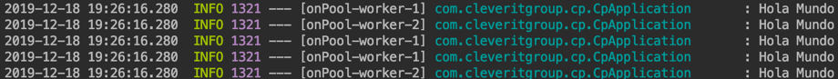
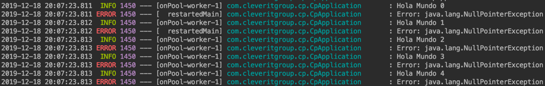
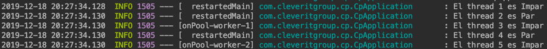
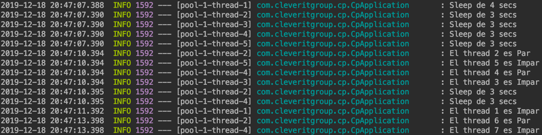

# Introducción al trabajo asíncrono con CompletableFuture


Hay ocasiones en que nos vemos enfrentados a solicitudes como estas:

- "Quiero procesar un archivo, pero no quiero esperar a que termine para hacer algo más"
- "¿Cómo puedo procesar un volumen muy grande de información, sin que mi usuario se de cuenta?"

Esas problemáticas, como otras, existen debido a que muchas veces nuestros desarrollos se ven limitados a la programación lineal, por lo que se debe terminar un proceso para comenzar otro.
Gracias a la introducción de la clase CompletableFuture en Java 8, este tipo de problemas ahora pueden abordarse de una manera más sencilla.
En este documento explicaremos, de forma simple, cómo podemos abarcar los trabajos asincrónicos o descolgados en Java. Para hacer este post más amigable, reduciremos el CompletableFuture a nuestra querida sigla CP

## ¿Qué es el CompletableFuture?

El CompletableFuture o CP es una clase que implementa la interface Future, introducida en Java 5. Esta última no mantenía muchos métodos que simplificaran el manejo y control de los trabajos asíncronos, es más, era complicado controlarlos sin que quedaran desastres con múltiples procesos dando vueltas.
Con la introducción de CP, se agregan alrededor de 50 métodos que nos permiten combinar, componer y ejecutar trabajos o procesos asíncronos incluyendo el manejo de errores.

## ¿Qué debemos tener en cuenta?

Primero, debemos entender que, para poder correr procesos paralelos, aunque podamos hacerlo usando el thread principal de Java, idealmente debemos hacerlo con un thread independiente, de esta manera nos aseguramos de no saturar nuestro proceso principal.

Para hacer esto usaremos un ExecutorService, el que nos permitirá crear un pool de threads nuevos e independientes, del tamaño que necesitemos, según la cantidad de hilos paralelos que estimemos necesarios.

```java
  ExecutorService demoPool = Executors.newFixedThreadPool(5);
```

Para este demo, usaremos un pool de tamaño 5, es decir, un máximo de cinco threads.
Si nuestro CP tiene más de cinco trabajos a ejecutar, ocurrirá que, los que se vayan sumando, irán a la cola, de manera de que, al desocuparse un thread, el siguiente de la cola comenzará a trabajar.
El tamaño del pool es algo a considerar, ya que debemos saber bien la capacidad que tiene el equipo o servidor donde correrá nuestro Java, pues la idea es no dejarlo sin recursos y que se provoque posteriormente el fallecimiento de nuestra aplicación.

Dentro de este demo, usaremos la clase Logger, para salir del clásico System.out, lo llamaremos myLog (¿muy original, no?)

## ¿Cómo lo implemento?

La implementación del CP es bastante sencilla. Primero, instanciemos un CP con el nombre de variable que queramos.

```java
  CompletableFuture cp = new CompletableFuture();
```

Hasta acá todo bien y tranquilo. Pero ahora comienza lo divertido: hacer muchas cosas en paralelo.
Para que el CP trabaje, usamos lo que en Java se conocen como Lambdas; si este término es nuevo o desconocido para ti, te recomiendo darte una vuelta por el siguiente articulo [Stream Lambdas Java](https://www.cleveritgroup.com/stream-lambdas-java) donde se explican estupendamente qué son y cómo los usamos.

Para este demo, usaremos dos métodos del CP, ambos funcionan de manera similar, pero tienen una gran diferencia

- runAsync: no tiene ningún retorno
- supplyAsync: tiene retorno.

Ahora, hagamos un cliché:

```java
    cp.runAsync(()->{
    	myLog.info("Hola Mundo");
    });

```

Si lo ejecutamos, tendremos algo como lo siguiente:

```java
	INFO 1315 --- [onPool-worker-1] com.cleveritgroup.cp.CpApplication       : Hola Mundo
```

Si te das cuenta, estoy usando el método **runAsync**, este nos permite ejecutar de manera directa el código utilizando Lambda, pero trae una limitante: no tiene ningún tipo de retorno.

Estresémoslo un poco, que sean múltiples Hola Mundo:

```java
	for(int init=0; init<5; init++) {
		cp.runAsync(() -> {
			myLog.info("Hola Mundo");
		});
	}
```

No es muy creativo, pero nos permite hacernos una idea:



Si nos fijamos, todo se ejecutó en el mismo instante, pero en hilos diferentes, "onPool-worker-X"
La X es el número de thread usado. Al ser algo sencillo, los threads se liberaron muy rápido, pero pudimos ver que eran dos threads.

Hasta acá nuestra aplicación no genera errores, funciona como reloj, pero ¿qué ocurre cuando tenemos un error?
Forcemos, entonces, un error:

```java
	CompletableFuture cp = new CompletableFuture();
	for(int init=0; init<5; init++) {
		String hola = String.format("Hola Mundo %s",init);
		String adios = String.format("Adios %s",init);
		cp.runAsync(() -> {
			myLog.info(hola);
			Object c = null;
			c.toString();
			myLog.info(adios);
		});
	}
```

Cuando lo ejecutamos, solo vemos el "Hola mundo", pero no vemos el "Adiós".
Esto ocurre porque los threads generaron alguna excepción durante su ejecución.

Si esto ocurre sin algún tipo de control, nuestro proceso no se completará y algo podría quedar mal.

Aquí es donde entra el manejo que tiene el CP.
Tenemos dos métodos que podemos usar para controlar:

- Handle: se ejecuta de manera automática, cuando el proceso asíncrono termina sin problemas.
- Exceptionally: se activa cuando ocurre cualquier tipo de excepción.

Aplicamos primero el Exceptionally, de manera que podamos ver qué excepción tuvimos con el código anterior:

```java
	CompletableFuture cp = new CompletableFuture();
	for(int init=0; init<5; init++) {
		String hola = String.format("Hola Mundo %s",init);
		String adios = String.format("Adios Mundo %s",init);
		cp.runAsync(() -> {
			myLog.info(hola);
			Object c = null;
			c.toString();
			myLog.info(adios);
		}).exceptionally(ex->{
			myLog.error("Error: {}",ex.getMessage());
			return null;
		});
	}

```

Al ejecutar con el Exceptionally, podemos observar un NullPointerException:



Este Exceptionally, nos abre una puerta para controlar las excepciones.
A través de él, se pueden invocar funciones que hagan otras acciones y así controlar el funcionamiento de nuestra aplicación.

Bueno, con esto creeremos que está todo OK. Pero, para que lo esté debemos hacer uso del Handle, que nos ayudará a ejecutar tareas post procesar.
Lo usaremos en conjunto con el supplyAsync, que nos permitirá tener retorno de nuestro proceso.

```java
	CompletableFuture cp = new CompletableFuture();
	for (int init = 0; init < 5; init++) {
		final Integer numeral=init+1;
		cp.supplyAsync(() -> {
			if(numeral%2==0){
				return "Par";
			}else{
				return "Impar";
			}
		}).handle((result, ex) -> {
			myLog.info("El thread {} es {}",numeral, result);
			return null;
		}).exceptionally(ex -> {
			myLog.error("Error: {}", ex.getMessage());
			return null;
		});

	}
```

Podemos ver que el Handle tomó la información desde el retorno del proceso principal y realizó una acción al terminar el principal



Esto nos permitiría ejecutar acciones posteriores, por ejemplo, grabar un resultado en una base de datos.

Bien, hemos abarcado de manera muy sencilla lo que podemos hacer con el CP, pero ojo, todo ha ocurrido desde el pool principal de nuestra aplicación.
Esto podría significar una caída completa si no controlamos bien nuestro CP, o si nos quedamos sin recursos suficientes.
Para que esto no ocurra, anteriormente hablamos de un ExecutorService, que nos ayudaría a controlar la cantidad de threads, separándolos del pool principal.

Para efecto de poder ver los paralelos, usaremos un Sleep.

```java
	public static void run4() {
		ExecutorService demoPool = Executors.newFixedThreadPool(5);
		CompletableFuture cp = new CompletableFuture();
		for (int init = 0; init < 7; init++) {
			final Integer numeral=init+1;
			cp.supplyAsync(() -> {
				return parImparSleep(numeral);
			},demoPool).handle((result, ex) -> {
				myLog.info("El thread {} es {}",numeral, result);
				return null;
			}).exceptionally(ex -> {
				myLog.error("Error: {}", ex.getMessage());
				return null;
			});

		}
	}

	private static String parImparSleep(Integer numero){
		try{
			Random aleatorio = new Random(System.currentTimeMillis());
			int intAletorio = aleatorio.nextInt(5);
			myLog.info("Sleep de {} secs",intAletorio);
			TimeUnit.SECONDS.sleep(intAletorio);
		}catch (Exception e){
			System.out.println(e.getMessage());
		}
		if(numero%2==0){
			return "Par";
		}else{
			return "Impar";
		}
	}
```

Usamos un pool de máximo de cinco, pero nuestro código usará siete CP, por lo que podremos observar que, al llegar al límite, simplemente encolará los siguientes y se ejecutarán a medida que los threads anteriores vayan terminando.



## ¿Qué sigue?

Por lo pronto, hasta acá llegamos con la introducción a los CompletableFuture.
Espero que les sirva como una base a sus proyectos y saquen el mayor provecho de esta herramienta

Acá les dejo un [Demo Descargable](https://1drv.ms/u/s!As3VWf_hoCLsi-cS0WewK0mkdd_taA?e=jeea0R), para que lo vean y prueben.
