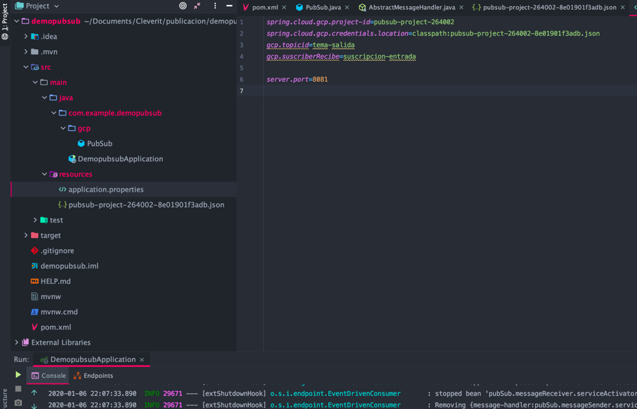

# Pub/Sub de Google Cloud Platform + Java Spring Boot


En este post les contaremos qué es el servicio Pub/Sub, cómo podemos utilizarlo con Java Spring Boot y sus librerías, también se mostraran beneficios y ejemplos de uso de estas tecnologías.

## Pub/Sub

Pub/Sub es un servicio de la plataforma nube de Google (GCP) que permite enviar mensajes asíncronos con varios remitentes y varios destinatarios. En esta dinámica, uno debe realizar el rol de emisor (publicador/publisher) y otros de receptor (suscripción/subscriber), ambos trabajan por separado. Este servicio permite una comunicación segura con mensajes duraderos y de baja latencia.

## Conceptos Básicos

- **Temas (topic)**: un recurso al que los publicadores (publishers) envían mensajes.
- **Suscripciones (subscriber)**: recurso al que uno se inscribe para recibir mensajes.
- **Mensaje**: lo que un publicador envía a un tema y se entrega, finalmente, a los suscriptores.
- **Atributos de mensaje**: valores llave que el publicador puede definir para un mensaje.

A modo de ejemplo, en la siguiente foto se pueden observar distintas formas de interacción de mensaje entre publicador (publisher) y suscriptores (subscriber).


A la izquierda, se puede ver cómo dos publicadores dejan sus mensajes en distintas suscripciones, pero las recibe un mismo suscriptor. En cambio, en el caso de la derecha un solo publicador deja mensajes en distintas subscripciones y los mensajes son recibidos por dos suscriptores conectados a subscripciones distintas.

Cabe mencionar que los suscriptores pueden cambiar, actualizarse, multiplicarse o desaparecer y el sistema se ajusta dinámicamente.

Algunos ejemplos en los que se podría utilizar GCP Pub/Sub serían los siguientes:

- **Lista de distribución de noticias**: como suscriptores podemos suscribirnos a ciertos canales de noticias que sean de nuestro interés, y en cuanto se publique una noticia, esta será recibida por nosotros.
- **Procesamiento asincrónico paralelo**: los eventos publicados en un tema pueden hacer que varias aplicaciones suscritas realicen tareas al mismo tiempo, pero no relacionadas entre ellas.
- Servicio de alertas y monitorizaciones.
- Se puede utilizar para avisar de nuevas versiones de software a los usuarios.
- Balancear cargas de trabajo dividiendo una tarea más grande en muchas más pequeñas utilizando la cola de mensajes Pub/Sub.

## Implementación con Java Spring Boot

Luego de esta pequeña introducción sobre GCP Pub/Sub, les mostraremos cómo implementarlo y utilizarlo con Java Spring Boot y sus librerías.

Primero, debemos ingresar a GCP y presionar la lista de proyectos. Para realizar este tutorial crearemos un nuevo proyecto y, luego, lo seleccionaremos.


Después, vamos a crear una cuenta de servicio; para eso tenemos que ir al menú lateral, presionar IAM, administración y, finalmente, cuenta de servicio.


Luego, crearemos una cuenta y es **muy importante** que, al momento de crear la cuenta, le demos permisos de suscriptor y publicador de Pub/Sub.


Otro elemento **muy importante** es que, en el paso 3, crearemos una clave; para este caso vamos a elegir json. Esto guardará un archivo json en nuestro computador.


Una vez creada la cuenta vamos a ir a Pub/Sub en el menú lateral de GCP y crearemos dos temas y dos suscripciones. Un tema/suscripción de entrada del que recibiremos los mensajes y un tema/suscripción de salida en el que dejaremos los mensajes.


Ahora, a los temas y suscripciones, les otorgaremos la cuenta de servicio creada anteriormente. Dejaremos el tema de entrada con permiso de Pub/Sub suscriptor y el tema de salida con permiso de Pub/Sub publicador. Ambas suscripciones quedarán con permiso de suscriptor para poder obtener los mensajes de ambos Pub/Sub.


Con eso listo crearemos el proyecto maven (manejador de dependencias o librerías) con Java Spring Boot, lo llamaremos **demopubsub**. Al crear el proyecto con Spring Boot debemos seleccionar que queremos las dependencias necesarias para utilizar Pub/Sub.


Es muy necesario que indiquemos los siguientes campos en nuestro properties:

```java
spring.cloud.gcp.project-id=pubsub-project-264002
spring.cloud.gcp.credentials.location=classpath:pubsub-project-264002-8e01901f3adb.json
gcp.topicid=tema-salida
gcp.suscriberRecibe=suscripcion-entrada
```

**project-id** es el identificador del proyecto, lo obtuvimos con anterioridad al crear el proyecto en GCP. La localización de las credenciales la dejaremos dentro de nuestro proyecto. Estas credenciales pueden estar en nuestro computador u obtenerse mediante secretos, dependiendo de la necesidad. TopicId es el tema en el que dejaremos el mensaje y, finalmente, sucriberRecibe es la suscripción desde la que obtendremos el mensaje.

Tal como se puede observar en la siguiente imagen, el archivo con las credenciales lo dejamos dentro de _resources_:



Ahora debemos crear nuestra clase Pub/Sub, que será la que recibirá el mensaje y luego lo enviará. Esta clase debe tener la anotación @Configuration, esto porque los varios métodos que nos otorga Spring para trabajar con Pub/Sub son @Bean.

Primero, vamos a crear nuestro canal de entrada, al que le entregamos como parámetros un canal de entrada de Pub/Sub y un template Pub/Sub.

Como se puede ver en la siguiente imagen para crear un PubSubInboundChannelAdapter se debe pasar el template Pub/Sub y la suscripción de donde recibiremos los mensajes. Además, agregamos el canal de entrada y, finalmente, para este caso pondremos acuse manual, de esta forma el mensaje permanecerá “vivo” hasta que nosotros realicemos el acuse o se acabe su tiempo de vida configurado en GCP.

```java
@Bean
public PubSubInboundChannelAdapter messageChannelAdapter(
    @Qualifier("pubsubInputChannel") MessageChannel inputChannel, PubSubTemplate pubSubTemplate) {
  PubSubInboundChannelAdapter adapter =
      new PubSubInboundChannelAdapter(pubSubTemplate, suscriberid);
  adapter.setOutputChannel(inputChannel);
  adapter.setAckMode(AckMode.MANUAL);

  return adapter;
}
```

Después, crearemos el método con el que recibimos el mensaje y con el que, también, gatillaremos el envío del mensaje a nuestro Pub/Sub de salida.

```java
@Bean
@ServiceActivator(inputChannel = "pubsubInputChannel")
public MessageHandler messageReceiver() {
  return message -> {
    LOGGER.info("Message arrived! Payload: " + new String((byte[]) message.getPayload()));
    sendMessagePubSub(new String((byte[]) message.getPayload()));
    BasicAcknowledgeablePubsubMessage originalMessage =
        message
            .getHeaders()
            .get(GcpPubSubHeaders.ORIGINAL_MESSAGE, BasicAcknowledgeablePubsubMessage.class);
    originalMessage.ack();
  };
}
```

En la imagen se muestra que el mensaje viene en el Payload y se puede ver el método sendMessagePubsub al que le estamos pasando el mensaje, que es el que enviará el mensaje a nuestro siguiente Pub/Sub. Luego, creamos un objeto con el que realizaremos el acuse del mensaje, esto lo hacemos obteniendo el GcpPubSubHeaders.ORIGINAL_MESSAGE de tipo BasicAcknowledgeablePubsubMessage (mismo que el objeto que estamos creando) del header del mensaje. Finalmente, realizamos el acuse del mensaje.

Ahora vamos a enviar un mensaje por medio del Pub/Sub:


En la siguiente imagen se puede ver cómo estamos recibiendo el mensaje, que contiene el payload y los headers.


También se puede observar que GcpPubSubHeaders.ORIGINAL_MESSAGE tiene la misma key que trae uno de nuestros headers del mensaje.


Finalmente, para enviar el mensaje utilizaremos el método sendMessagePubSub, el cual vimos anteriormente cuando recibimos el mensaje. Este llamará al método sendToPubSub que está dentro de la interfaz ReportPubSubOutboundGateway. Esta interfaz utiliza la anotación MessagingGateway.

```java
public void sendMessagePubSub(String json) {
  messageGateway.sendToPubsub(json);
}
```

```java
@MessagingGateway(defaultRequestChannel = "pubsubOutputChannel")
public interface ReportPubSubOutboundGateway {
  void sendToPubsub(String text);
}
```

El canal de salida de Pub/Sub se configura con el método que se ve en la siguiente imagen, este método maneja el envío de mensaje. Al igual que el canal de entrada, este utiliza un template Pub/Sub, pero como diferencia ahora le indicamos el tema de salida que utilizaremos y al que queremos enviarle el mensaje.

```java
@Bean
@ServiceActivator(inputChannel = "pubsubOutputChannel")
public MessageHandler messageSender(PubSubOperations pubsubTemplate) {
  return new PubSubMessageHandler(pubsubTemplate, topicId);
}
```

Finalmente, si revisamos nuestro Pub/Sub encontramos el mensaje enviado anteriormente.


Como pudieron observar, Pub/Sub se puede utilizar de manera muy sencilla con Spring y también se puede usar con C#, NodeJS, PHP, Ruby, entre otros.

Además de eso, nos permite tener aplicaciones que dependen de eventos en tiempo real basados en la recepción de mensajes, eliminando la necesidad de que los consumidores de mensajes tengan que consultar periódicamente para obtener una nueva información. Esto promueve un tiempo de respuesta más rápido y reduce la latencia de entrega de mensajes.

Con Pub/Sub los publicadores y suscriptores están desacoplados y trabajan independientes el uno del otro, lo que permite desarrollarlos y escalarlos independientemente según cada requerimiento sin afectar otros Pub/Sub.

La codificación de una aplicación que se conecta con Pub/Sub es menos compleja, ya que elimina todas las conexiones punto a punto y, en su lugar, se utiliza una única conexión a un tema. Además, permite decidir de forma sencilla qué mensajes deben enviarse y a qué puntos finales se deben enviar por medio de las suscripciones y temas.
